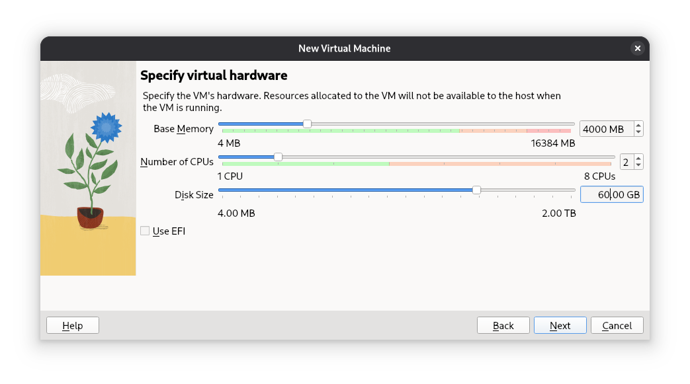
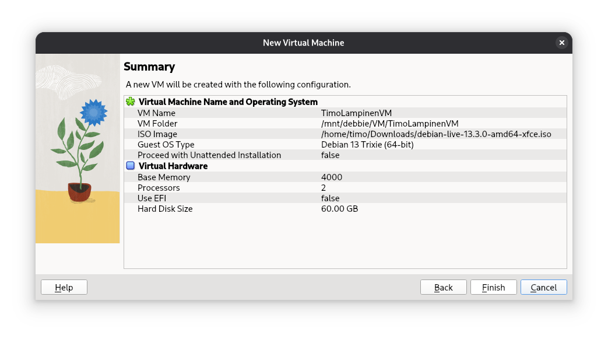
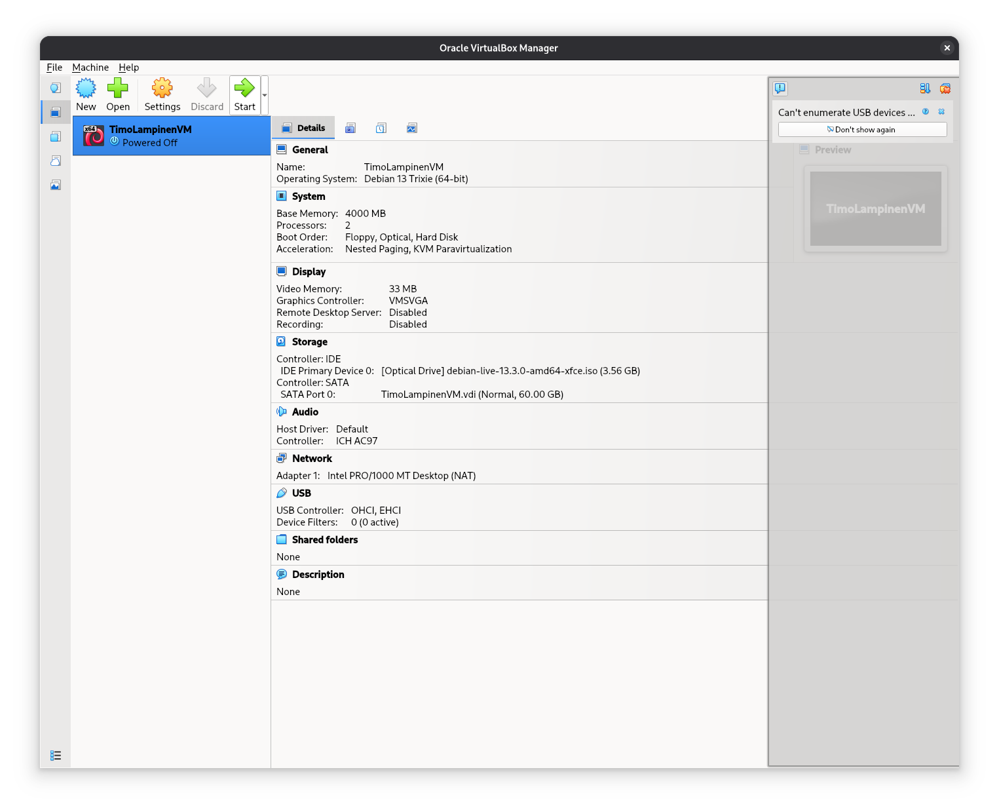
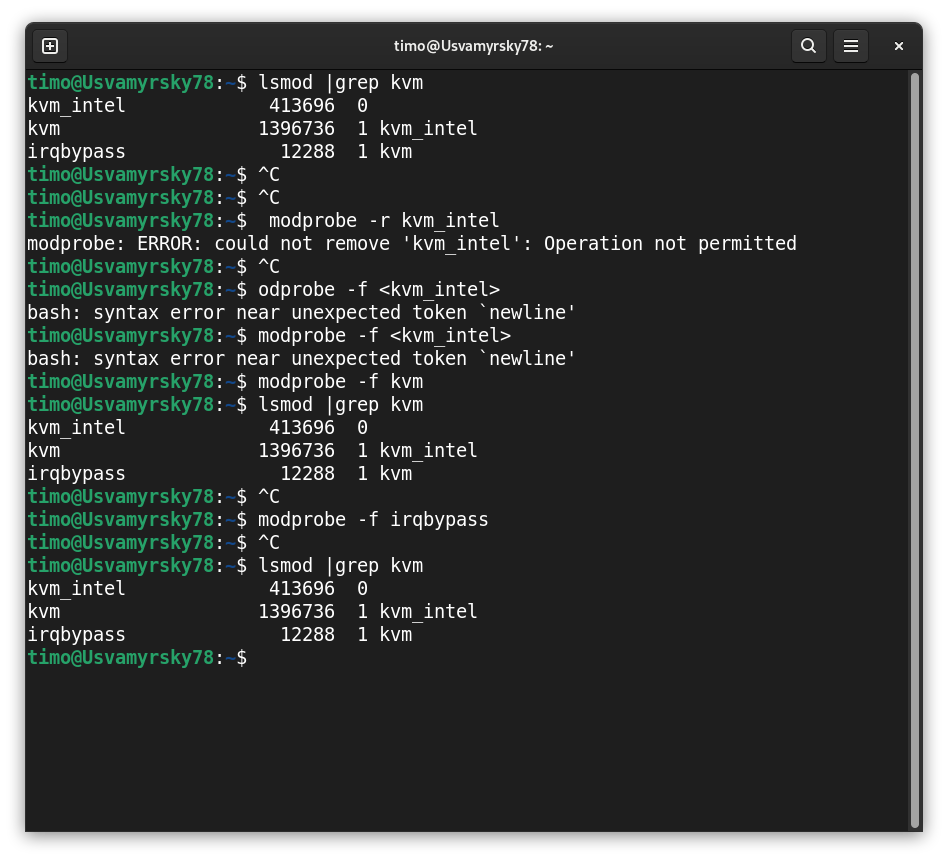

# TEHTÄVÄ H1 - LINUXIN ASENTAMINEN VIRTUAALIKONEESEEN

 Käytössä pc-pohjainen linux Debian 13. Kernel versio 6.12.63+deb13-amd64

 ## Virtualboxin asentaminen

 15:30
 Seurasin ohjeita ja selvisi, että Debian 13 mukana ei tule oletuksena Virtualboxia. 
 Yritin seurata Oraclen sivun ohjeita, mutta tämähän meni monimutkaiseksi..
 Käytännössä nyt näyttää siltä, että ilmeisesti virtualboxista ei ole olemassa Debian 13 tukevaa versiota.
 Vaihtoehdoiksi siis jää:
 1. asentaa debian12 Bookworm ja siihen VirtualBox
 2. asentaa m1 mac:lle virtualbox, mikä taitaa olla hankalaa sekin
 3. asentaa KVM + virt-manager ja tehdä tätä kautta virtuaalikone

Kokeilen asentaa KVM + virt-managerin. Debian 12 asennus toiseksi olisi varmaan helpompaa, mutta ehkäpä
tämä opettaa enemmän. Katsotaan miten käy. Kysyn ChatGTP:ltä ohjeet asennukseen. 
### huom! Myöhemmin asennan Virtuaboxin Debianiin, koska sekin kyllä onnistuu
[Mene suoraan VirtualBoxin asennukseen](#Asennetaan-virtualbox)

## KVM ja Virtual Machine Manager asennus

16:13 Asennus onnistui helposti ja Virtual Machine Manager on nyt auki.

Minulla on mac:ssä BalenaEtcher ohjelma, millä tein edellisen Linuxin käynnistystikun. Sillion "tikkuna" toimi
500 gigan kovalevy. Nyt ostin usb3.0 tikun tätä varten. Latauksen pistin tulemaan tuossa jo hetki sitten. 
Kyseessä on debian-live-13.3.0-amd64.xfce.iso mistä kortille tehdään flash device

 16:18 tutustun samalla VirtualBox ohjeisiin, kun Flash Device syntyy. 
 
 ### Uuden virtual machinen luominen
 käytössä KVM ja Virtual Manager - ympäristö Linux Debian 13

 Uuden koneen luomisen nappi löytyi, nyt täytyy vain olla ISO image, jonka teko on vielä kesken.

 16:29 tämä onkin nyt hyvin erinäköinen ja ilmeisesti eri tavalla toimiva, mutta tutkitaan mit pitää valita.
 .iso levytiedosto onkin parempi valita, kuin tämä Flash device. Nopittiinpa tämäkin. 
 16:36 .iso kuva on ladattu ja päästään eteenpäin
 Nyt ollaankin antamassa koneelle jo muistimääriä ja lebynkokoa yms..

 16:40 mulla on toinen SSD levy koneessa ja yritän tehdä sille tuota virtuaalikoneelle varattua tilaa..
 Ehkä kyseessä on tuo create storage pool. Käytin sitä ja tein 40 gigan pool:n sitä varten. 

 16:43 nyt ollaankin tässä graafisessä käyttöliittymässä

 No helvetti - jotenkin se hyppäsi eteenpäin tuosta graafisesta käyttöliittymästä johonkin, joten tuhosin koko 
 homman aja aloitan alusta. Ei tää niin vaikeaa ole.

 16.48 uusi alustus

Jaahas tämä installointimenu onkin vähän erinäköinen - otan graafisen valinnan.

nimet, salasanat yms laitetaan
16.59 levyn parittiointi.. käytetään koko virtuaalilevy yhteen partitioon
Sit asennellaankin ja pitkään -- välillä on muutama valinta --
17.04 aah nyt pitääkin valita onko gnome xfce tms pr - olikohan dokumentaatiossa mitä olisi syytä käyttää 
alkutiedoissa olikin, että xfce - toisaalta sellainenhan me ladattiinkin - tai se eka lataus oli .iso versiossa taisi olla muutakin mukana
17:14 asennetaanko GRUB boot loader -> yes. Tämähän on virtuaalikone ja kaikki virtuaalinen levytilakin on määritelty tälle.
17:7 installation complete ja nyt reboot

17:19 bootti tehty ja kirjauduttu sisään -- nettiselaus ainakin toimii

17:20 tauko

17:40 sudo ap-get update -- no ei se mun peruskäyttäjän salasana toiminutkaan pitänee kokeilla root käyttäjän salasanaa
ööö nyt ei toimi root salasana, eikä hirvilammen salasana

menin root:n komennolla su -
asensin hirvilammen sudoersiin kommenolla: usermod -aG sudo hirvilampi
terminaalista ja ulos ja sisään
Sama homma jatkui, kunnes tajusin logata ulos. Restarttasin koko virtuaalikoneen varmuuden vuoksi
Perus päivitykset
17:54 firewall asennus ja restart

17:56 takaisin sisälle ja kokeillaan ohjelmia
Libreoffice Draw - ei kyllä vakuuta
Applikaatiot löytyy näklöjään täältä yläkulmasta
Teron kirjoja tuli katsottua
18:00 suurensin ikkunan koko ruudun kokoiseksi - mitenköhän tästä pääsee pois???
Shutdown .. 
18:10 no niin nyt onkin hyvä aika katsoa uudestaan mitä kaikkea piti tehdä ja huomata, 
että en ole ottanut yhtään kuvaa prosessista ja muutenkin olen kirjoittanut tätä viereisellä koneella, joten
kaikki virhe ilmoitukset ovat jääneet ottamatta talteen - tämähän menee hienosti.

Lähetin toisaalta aiemmin viestin Terolle, että voiko tehtävän tehdä KVM ja Virtual Machine Managerilla. 
En tänään torstaina kuluta enempää aikaa, jos joudunkin asentamaan vielä debian12 ja virtualboxin..

18:13 googlen mukaan virtualbox toimii debian 13:ssa.. nyt on hämmentävää. Täytyy kokeilla

## Asennetaan virtualbox 
18:17 -> kokeilen uusia ohjeita: https://www.linuxtechi.com/how-to-install-virtualbox-on-debian/
tähän pari kuvaa 

18:25 uuden levykuvan lataus alkamaan

sit asennus ja annetut tiedot

18:40 nyt ihmettelen, että tuo ei suoraan anna tuota create virtual hard disk
- se löytyykin storagesta ja näitä tekstejä voi klikata
- luon tänne uuden 60 gigan levyn

Jotain on siis nyt saatu jo tehtyä

18:45 Virtualbox on asennettu yritin käynnistää virtuaalikonetta, mutta saan virheen: KÄYNNISTÄESSÄ VIRHE: 
VT-x is being used by another hypervisor (VERR_VMX_IN_VMX_ROOT_MODE)

tuota erroria haeskelin netistä, mutta nyt en jaksa enää alkaa korjaamaan sitä

19:00 tältä illalta tää on kyllä tässä

klo 16:10 Perjantai 16.1.2026 - paluu virtuaalikoneen asennuksen äärelle

(VERR_VMX_IN_VMX_ROOT_MODE) - on siis virhe, joka tulee käynnistäessä
Google haku tuottaa paljon tuloksia
ekat tulokset eivät näytä auttavan, mutta toisen vastauksen alla on 
linkki "Please disable tghe KVM kernel extension" https://forums.virtualbox.org/viewtopic.php?t=50517
tämän pitäisi näyttää KVM:n nimi: lsmod |grep kvm 
Kokeilen: lsmod |grep kvm
vastaus
*kvm_intel             413696  0
kvm                  1396736  1 kvm_intel
irqbypass              12288  1 kvm*

tämän pitäisi pysäyttää KVM moduuli: modprobe -r <kvm name>
kokeilen: modprobe -r kvm_intel
vastaus: 
*modprobe: ERROR: could not remove 'kvm_intel': Operation not permitted*

kokeilen: modprobe -f <kvm_intel>
vastaus: 
*bash: syntax error near unexpected token `newline'*

kokeilen: modprobe -f kvm
vastaus: tyhjää

kokeilen: lsmod |grep kvm
vastaus
*kvm_intel             413696  0
kvm                  1396736  1 kvm_intel
irqbypass              12288  1 kvm*

16:26 kokeilen käynnistää VirtualBoxin koneen

kokeilen : modprobe -f irqbypass
vastaus: *tyhjää*

kokeilen: lsmod |grep kvm
vastaus
*kvm_intel             413696  0
kvm                  1396736  1 kvm_intel
irqbypass              12288  1 kvm*

16:29 käynnistys virtuaalikoneessa ei onnistu tällä ohjeella. Palaan kokeilemaan google tuloksia

16:31 löytyy sivu, jossa annetaan toinen käsky millä poistaa KVM. Sivusto: https://avz.org.ua/wp/2025/04/25/virtualbox-virtual-machine-not-started-with-verr_vmx_in_vmx_root_mode-error/

*Solution:
sudo rmmod kvm_intel kvm*

En tiedä komennosta mitään, ei nettisaittikaan vaikuta "turvalliselta". Kysyn ChatGTP5.2 tämän: onko tämä turvallinen koodi ajaa debian trixie linuxissa: sudo rmmod kvm_intel kvm

vastauksen pääosio 

*"Yleisesti: se ei ole “vaarallinen” siinä mielessä, että se ei riko levyä tai poista tiedostoja, mutta se voi katkaista käynnissä olevat virtuaalikoneet ja poistaa Intel KVM -virtualisoinnin käytöstä siihen asti, kunnes moduulit ladataan takaisin (tai kone käynnistetään uudelleen).

Mitä komento tekee:

sudo rmmod kvm_intel kvm

poistaa ytimestä ensin kvm_intel-moduulin (Intel KVM -kiihdytys), ja sitten kvm-ydinmoduulin.

Tämä käytännössä sammuttaa KVM-virtualisoinnin järjestelmästä sillä hetkellä.

Milloin se on “turvallista”:

Jos et aja mitään KVM:ää käyttäviä VM:iä/kontteja/emulaattoreita (QEMU/KVM, libvirt, GNOME Boxes, virt-manager, minikube tms. KVM-taustalla), komento on yleensä ok.

Jos et ole varma: komento voi epäonnistua “in use” -tyyppisesti, jos moduulit ovat käytössä.

Riskit / haitat:

Käynnissä olevat virtuaalikoneet kaatuvat tai pysähtyvät (pahimmillaan datakorruptio VM:n sisällä, jos levybufferit jäävät kesken).

Virtualisointia käyttävät palvelut voivat mennä sekaisin ja vaatia restartin.

Jos ajurit ovat käytössä, rmmod voi kieltäytyä poistamasta moduuleja (tämä on “hyvä” turvamekanismi)."*

Lienee siis turvallista kokeilla tuota, koska KVM pyörii koko ajan taustalla. 
Mutta ennen tuota kysyn myös ChatGTP5.2 mitä se tekisi kysymyksellä: 
mikä virhe virtualbox:ssa: VT-x is being used by another hypervisor (VERR_VMX_IN_VMX_ROOT_MODE)

Tässä tuleekin pitempi ohje ja selkeämpi.. komento on eri: *sudo modprobe -r kvm_intel kvm*
Nämä ohjeet ovat 6 selkään osaan ja alkaa noilla samoilla tarkistuksilla mikä on käynnissä.

*timo@Usvamyrsky78:~$ sudo systemctl stop libvirtd
sudo systemctl stop virtlogd
[sudo] password for timo: 
Stopping 'libvirtd.service', but its triggering units are still active:
libvirtd.socket, libvirtd-ro.socket, libvirtd-admin.socket
Stopping 'virtlogd.service', but its triggering units are still active:
virtlogd.socket, virtlogd-admin.socket*

hmmm. no jatketaan. Tämä poistaa KVM kernel moduulit: 
sudo modprobe -r kvm_intel kvm

Ei tule mitään ilmoitusta.
kokeilen: lsmod | grep kvm
Vastauksena ei tule mitään, eli kyseiset moduulit eivät enää pyöri. Kokeilen tässä vaiheessa toimiiko virtuaalikone jo nyt.
Käynnistyi. Hienoa

Ohjeet jatkavat siitä, että miten kvm estetään pysyvästä. Otan nämä talteen, sillä saattaahan olla,etä kvm latautuu aina koneen käynnistäessä uudestaan.
Toisaalta voisin kai poistaa kvm: myös. Tässä kuitenkin ohjeet kvm:n käynnistyksen estämiseen:

Blacklistaus:

sudo nano /etc/modprobe.d/blacklist-kvm.comf

blacklist kvm
blacklist kvm_intel

rebootin jälkeen tarkistus:

lsmod | grep kvm

17.07 Ehkä tämä olisi järkevintä kokeilla nyt. Reboottaan koneen.

17:23 kyllähän ne vielä näkyvät tuolla. -- jatkan virtualboxin asennusta ja palaan tähän myöhemmin

TimoLampinenVM[Running] - Oracle VirtualBox
Toimii ja ulkopuoliset sivut latauvat we browserissa.

17:30 sitten itse installoinnin kimppuun
17:37 perustiedot laitettu ja nyt kone alkoi tekemään töitään
17:43 asennus on valmistunut jossain välissä
reboot
17:44 pelkkä taustakuva näkyy edelleen
17:44 nythän se vasta käynnistyi uudestaan
17:45 First Login - salasana pelittää ja pääsin sisään
17:46 käynnistetään web selain
17:47 oma portfolio-sivu aukeaa
17:48 sitten terminaali auki 
17:49 sudo apt-get update - toimii ja hakee päivitykset (19 kappaletta)
17:49 sudo apt-get -y install ufw - tehty
17:50 sudo ufw enable - firewall is active and enabled.. 
17:51 restart
17:52 kaikkihan näyttää pelittävän
17:56 virtualbox guest additions.. kai tämä on tarkoitus asentaa

18:00 asennettu ohjeiden mukaan, ei virheitä, ei myöskään sudo bash VBoxLinuxAdditions.run käytettäessä

18:02 uudelleen käynnistys ja snapshot

 
 
 

 

