Kirjoittanut Timo Lampinen  
Linux-palvelimet kurssi - ICI003AS2A-3016   
Tehtävä H1 sivulta: https://terokarvinen.com/linux-palvelimet/  

# TEHTÄVÄ H1 - LINUXIN ASENTAMINEN VIRTUAALIKONEESEEN LINUXILLE  
  
 Käytössä on PC-pohjainen Linux Debian 13.  
 Kernel: versio 6.12.63+deb13-amd64  
 Prosessori: Intel Xeon E3-1230  
 Muisti: 16Mb muistia  
 Levy: SSD   
 Näytönohjain: Nvidia   

 ## Virtualboxin asentaminen  

En löytänyt VirtualBoxia suoraan Debian 13:n paketeista, joten aluksi asensin ensin **KVM:n ja Virtual Machine Managerin**, joilla voi myös luoda virtuaalikoneita.  [Siirry KVM ja Virtual Machine Manager asennukseen](#kvm-ja-virtual-machine-manager)  
Tulin myöhemmin huomaamaan, että tuo asennus aiheuttaa ristiriitoja käynnistäessäni VirtualBoxin.

## Asennetaan VirtualBox  

18:17 
Seuraan Linuxtechi.com asennusohjeita: https://www.linuxtechi.com/how-to-install-virtualbox-on-debian/  

Asennetaan tarvittavat ohjelmat näin:
  
1. Lisätään VirtualBox apt rpositorioon  
*sudo apt install curl wget gnupg2 lsb-release -y*  
*curl -fsSL https://www.virtualbox.org/download/oracle_vbox_2016.asc | sudo gpg --dearmor -o /etc/apt/trusted.gpg.d/vbox.gpg*  
*curl -fsSL https://www.virtualbox.org/download/oracle_vbox.asc | sudo gpg --dearmor -o /etc/apt/trusted.gpg.d/oracle_vbox.gpg*
  
2. Seuraavalla komennolla asennetaaan Debian 13 VirtualBox:n apt repositorioon  
*echo "deb [arch=amd64] http://download.virtualbox.org/virtualbox/debian $(lsb_release -cs) contrib" | sudo tee /etc/apt/sources.list.d/virtualbox.list*

 3. Asennetaan VirtualBox Debian 13:sta  
*sudo apt update*  
*sudo apt install linux-headers-$(uname -r) dkms -y*  
*sudo apt install virtualbox-7.2 -y*

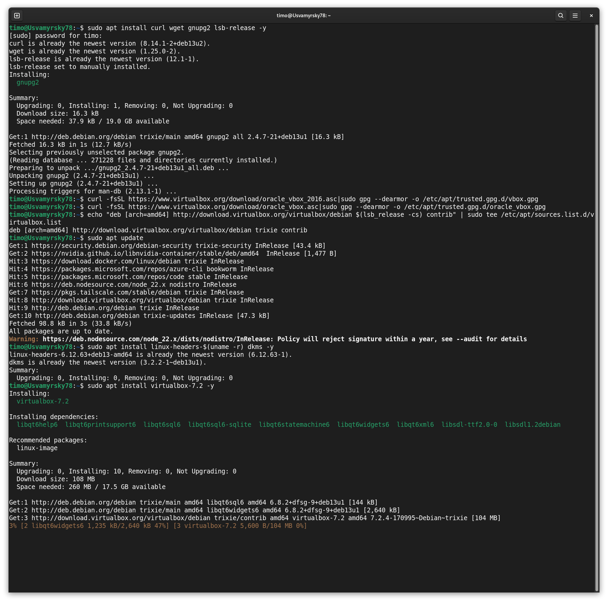  

4. Lisätään käyttäjä vboxusers ryhmään  
*sudo usermod -aG vboxusers $USER*  
*newgrp vboxusers*  

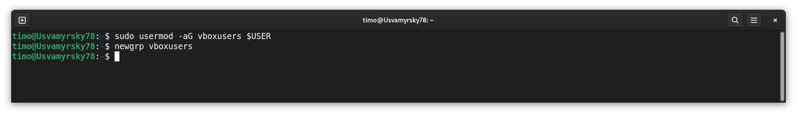

18:25 
Levykuvaksi valikoitui: debian-live-13.3.amd64.xfce.iso  

Latasin levykuvan ja asensin sen  

**Tästä välistä puuttuu välivaiheita**

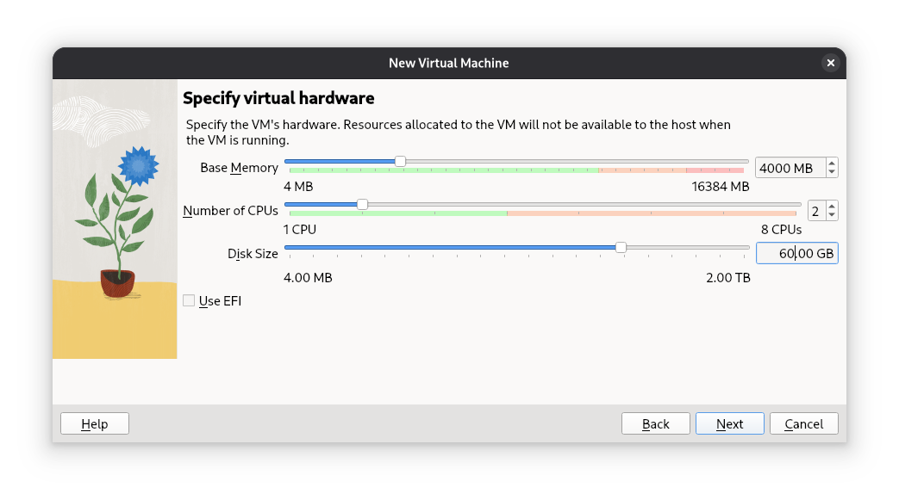

18:40 nyt ihmettelen, että tuo ei suoraan anna tuota create virtual hard disk  
- se löytyykin storagesta ja näitä tekstejä voi klikata  
- luon tänne uuden 60 gigan levyn  

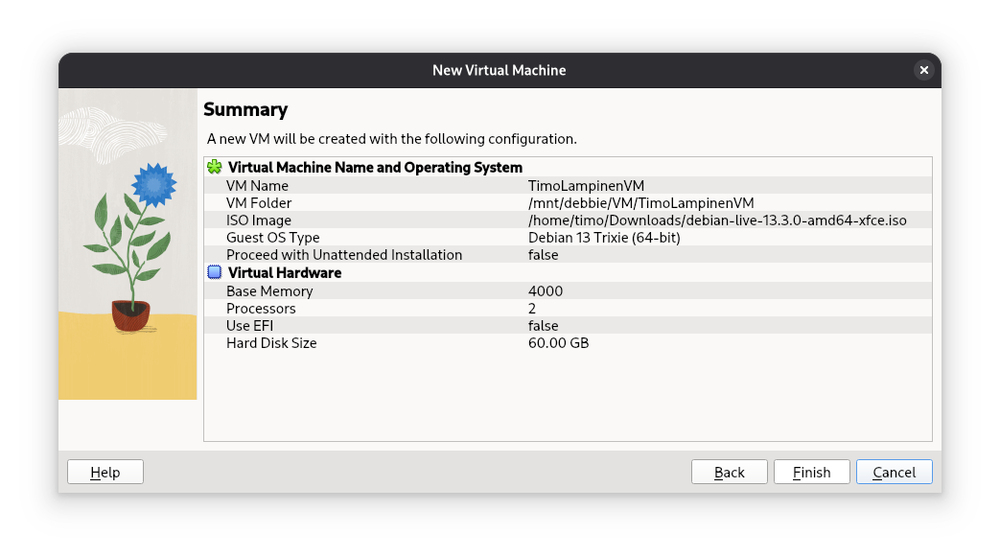

Jotain on siis nyt saatu jo tehtyä
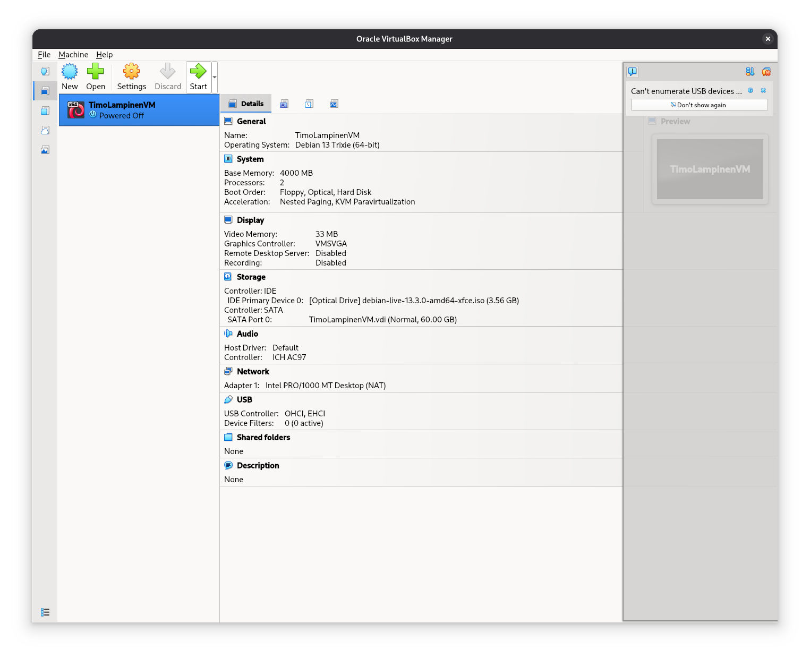

18:45 Virtualbox on asennettu yritin käynnistää virtuaalikonetta, mutta saan virheen:  
KÄYNNISTÄESSÄ VIRHE: 
*VT-x is being used by another hypervisor (VERR_VMX_IN_VMX_ROOT_MODE)*  

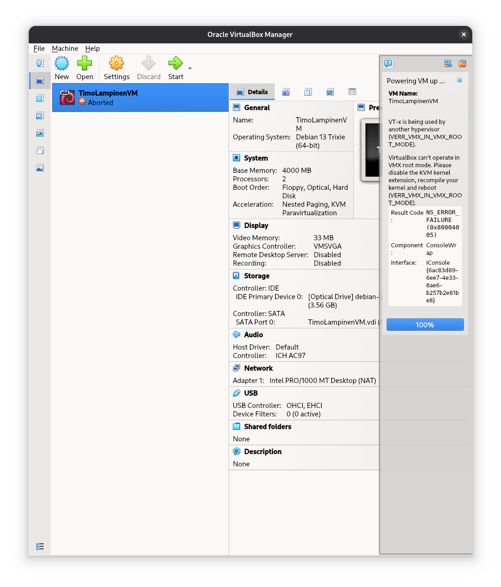

tuota erroria haeskelin netistä, mutta nyt en jaksa enää alkaa korjaamaan sitä  

19:00 tältä illalta tää on kyllä tässä  

klo 16:10 Perjantai 16.1.2026 - paluu virtuaalikoneen asennuksen äärelle  

(VERR_VMX_IN_VMX_ROOT_MODE) - on siis virhe, joka tulee käynnistäessä  
Google haku tuottaa paljon tuloksia  
ekat tulokset eivät näytä auttavan, mutta toisen vastauksen alla on   
linkki "Please disable tghe KVM kernel extension" https://forums.virtualbox.org/viewtopic.php?t=50517  
tämän pitäisi näyttää KVM:n nimi:  

*lsmod |grep kvm*   

Kokeilen sitä ja saan vastaukseksi:  

*kvm_intel             413696  0  
kvm                  1396736  1 kvm_intel  
irqbypass              12288  1 kvm*  

Tästä näemme, että kvm_intel ja kvm ovat vielä päällä, koskan niiden arvo on 1.

tämän pitäisi pysäyttää KVM moduuli:  modprobe -r <kvm name>  

*modprobe -r kvm_intel*  

Kokeilen sitä ja vaustaus on:   

*modprobe: ERROR: could not remove 'kvm_intel': Operation not permitted*  

kokeilen:  
*modprobe -f <kvm_intel>*  
vastaus:   
*bash: syntax error near unexpected token `newline'*  

kokeilen: 
*modprobe -f kvm* 
vastaus: 
(tyhjää)  

kokeilen:  
*lsmod |grep kvm*  

vastaus:  

*kvm_intel             413696  0  
kvm                  1396736  1 kvm_intel  
irqbypass              12288  1 kvm*  

Ei auttanut.  

16:26 kokeilen käynnistää VirtualBoxin koneen  

kokeilen :  
*modprobe -f irqbypass*   
vastaus:  
*tyhjää*    

Ei auttanut.  

kokeilen:  
*lsmod |grep kvm*  
vastaus:  
*kvm_intel             413696  0  
kvm                  1396736  1 kvm_intel  
irqbypass              12288  1 kvm*  

Ei auttanut.  

16:29 käynnistys virtuaalikoneessa ei onnistu tällä ohjeella. Palaan kokeilemaan google tuloksia.  

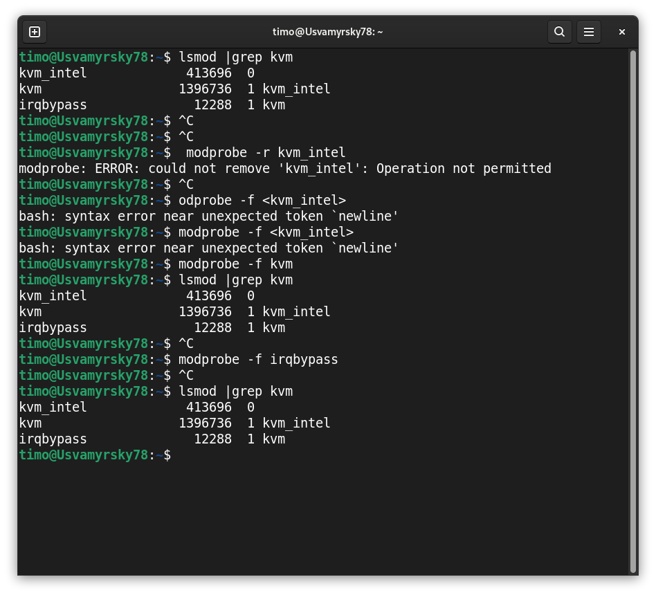  

16:31 löytyy sivu, jossa annetaan toinen käsky millä poistaa KVM. Sivusto: https://avz.org.ua/wp/2025/04/25/virtualbox-virtual-machine-not-started-with-verr_vmx_in_vmx_root_mode-error/  

Ratkaisu:
*sudo rmmod kvm_intel kvm*

En tiedä komennosta mitään, ei nettisaittikaan vaikuta "turvalliselta". Kysyn ChatGTP5.2 tämän: onko tämä turvallinen koodi ajaa debian trixie linuxissa: *sudo rmmod kvm_intel kvm*  

vastauksen pääosio   

*Yleisesti: se ei ole “vaarallinen” siinä mielessä, että se ei riko levyä tai poista tiedostoja, mutta se voi katkaista käynnissä olevat virtuaalikoneet ja poistaa Intel KVM -virtualisoinnin käytöstä siihen asti, kunnes moduulit ladataan takaisin (tai kone käynnistetään uudelleen).  

Mitä komento tekee:  

*sudo rmmod kvm_intel kvm*  poistaa ytimestä ensin kvm_intel-moduulin (Intel KVM -kiihdytys), ja sitten kvm-ydinmoduulin.  

Tämä käytännössä sammuttaa KVM-virtualisoinnin järjestelmästä sillä hetkellä.  

Milloin se on “turvallista”:  

Jos et aja mitään KVM:ää käyttäviä VM:iä/kontteja/emulaattoreita (QEMU/KVM, libvirt, GNOME Boxes, virt-manager, minikube tms. KVM-taustalla), komento on yleensä ok.  

Jos et ole varma: komento voi epäonnistua “in use” -tyyppisesti, jos moduulit ovat käytössä.  

Riskit / haitat:  

Käynnissä olevat virtuaalikoneet kaatuvat tai pysähtyvät (pahimmillaan datakorruptio VM:n sisällä, jos levybufferit jäävät kesken).  

Virtualisointia käyttävät palvelut voivat mennä sekaisin ja vaatia restartin.  

Jos ajurit ovat käytössä, rmmod voi kieltäytyä poistamasta moduuleja (tämä on “hyvä” turvamekanismi).*  

Lienee siis turvallista kokeilla tuota, koska KVM pyörii koko ajan taustalla.   
Mutta ennen tuota kysyn myös ChatGTP5.2 mitä se tekisi kysymyksellä:   
mikä virhe virtualbox:ssa: VT-x is being used by another hypervisor (VERR_VMX_IN_VMX_ROOT_MODE)  

Chatgtp ehdottaa komentoa 
**sudo modprobe -r kvm_intel kvm**  

Lisäksi ohjeet ovat jaettu kuuteen osaan.  ja alkaa noilla samoilla tarkistuksilla mikä on käynnissä.    

timo@Usvamyrsky78:~$ *sudo systemctl stop libvirtd*  
*sudo systemctl stop virtlogd*  
[sudo] password for timo:  
Stopping 'libvirtd.service', but its triggering units are still active:  
libvirtd.socket, libvirtd-ro.socket, libvirtd-admin.socket  
Stopping 'virtlogd.service', but its triggering units are still active:  
virtlogd.socket, virtlogd-admin.socket*  

hmmm. no jatketaan. Tämä poistaa KVM kernel moduulit:  
**sudo modprobe -r kvm_intel kvm**  

Ei tule mitään ilmoitusta. Tämä tarkoittaa, että toimii, koska virhe olisi tullut näkyviin.
kokeilen:  
*lsmod | grep kvm*  

Vastauksena ei tule mitään, eli kyseiset moduulit eivät enää pyöri. Kokeilen tässä vaiheessa toimiiko virtuaalikone jo nyt.    
Käynnistyi. Hienoa.  
**sudo modprobe -r kvm_intel kvm**  
pysäyttää kvm_intel ja kvm prosessit  

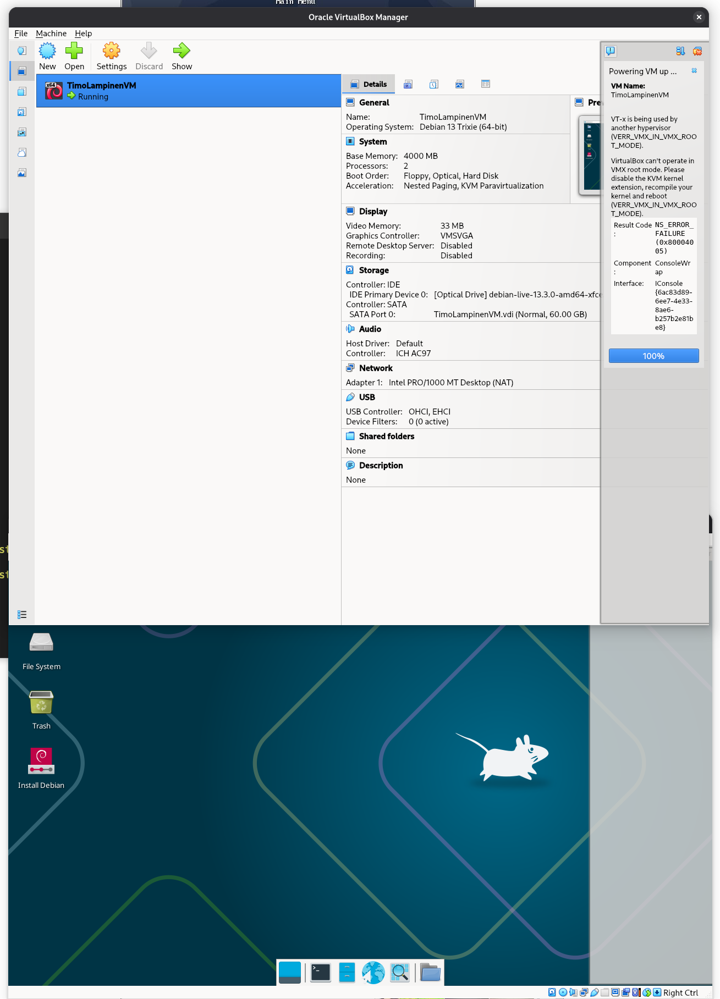

Ohjeet jatkavat siitä, että miten kvm estetään pysyvästä. Otan nämä talteen, sillä saattaahan olla,etä kvm latautuu aina koneen käynnistäessä uudestaan.  
Toisaalta voisin kai poistaa kvm: myös. Tässä kuitenkin ohjeet kvm:n käynnistyksen estämiseen:  

Blacklistaus:  

*sudo nano /etc/modprobe.d/blacklist-kvm.comf*  

*blacklist kvm*    
*blacklist kvm_intel*    

rebootin jälkeen tarkistus:    

*lsmod | grep kvm*    

17.07 Ehkä tämä olisi järkevintä kokeilla nyt. Reboottaan koneen.   

kokeilen:  
*lsmod |grep kvm*  
vastaus:  
*kvm_intel             413696  0  
kvm                  1396736  1 kvm_intel  
irqbypass              12288  1 kvm*  

Ei auttanut, joten poistan ne "käsin"  
*sudo modprobe -r kvm_intel kvm*  

17:23  jatkan virtualboxin asennusta ja palaan tähän myöhemmin   

TimoLampinenVM[Running] - Oracle VirtualBox  
Toimii ja ulkopuoliset sivut latauvat we browserissa.  

17:30 sitten itse installoinnin kimppuun  
17:37 perustiedot laitettu ja nyt kone alkoi tekemään töitään  
17:43 asennus on valmistunut jossain välissä  
reboot  
17:44 pelkkä taustakuva näkyy edelleen  
17:44 nythän se vasta käynnistyi uudestaan  
17:45 First Login - salasana pelittää ja pääsin sisään  
17:46 käynnistetään web selain  
17:47 oma portfolio-sivu aukeaa  
17:48 sitten terminaali auki   
17:49 *sudo apt-get update* - toimii ja hakee päivitykset (19 kappaletta)  
17:49 *sudo apt-get -y install ufw* - tehty  
17:50 *sudo ufw enable* - firewall is active and enabled..  
17:51 restart  
17:52 kaikki toimii    
17:56 virtualbox guest additions.. kai tämä on tarkoitus asentaa  

18:00 asennettu ohjeiden mukaan, ei virheitä, ei myöskään sudo bash VBoxLinuxAdditions.run käytettäessä  

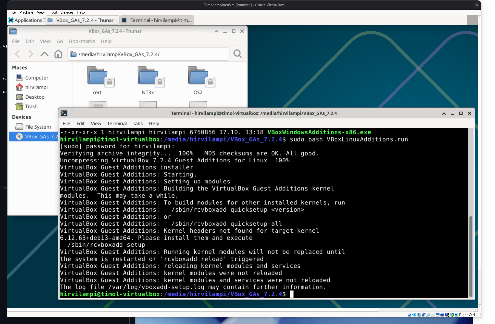  

18:02 uudelleen käynnistys ja snapshot   

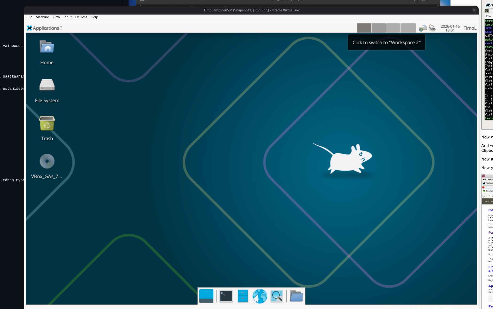  

## Bonustehtävä: suosikkiohjelmani Linuxilla   
terminaali on kyllä kova, kuten myös nettiselain sekä visual studio code.   
Valitsen terminaalin ja ls -l komennon  
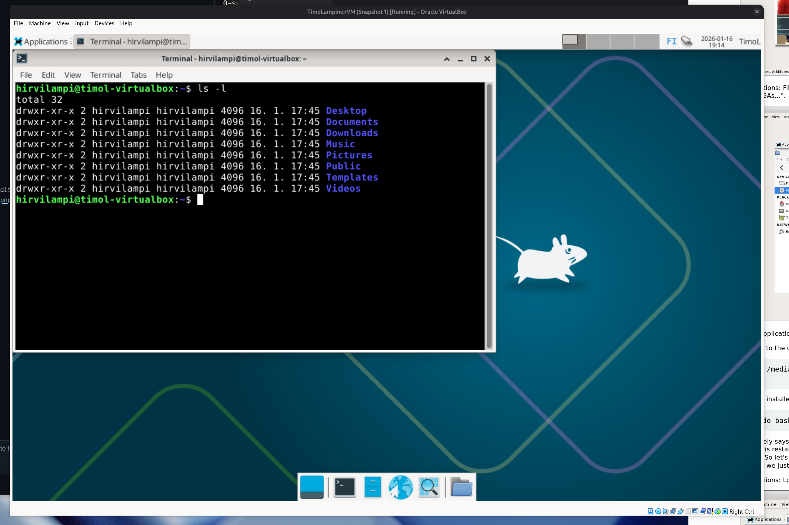  

## Pohdintaa tehtävästä  
Oma sekoilu tuotti enemmän töitä, kun ajattelin. Lopulta KVM ohjelman asentaminen ja sen ottaminen pois päältä tuottivat lisätöitä. Edelleenkin KVM aukeaa käynnistäessä, joten se ongelma ei vielä ratkennut. Saan sen kuitenkin yksinkertaisella käskyllä pois päältä. Isosti tässä tuli oppia, kun Linuxsiin joutui tutustumaan oikein kunnolla.   

## Lähteet
Karvinen 2026:  https://terokarvinen.com/linux-palvelimet/  
Virtualbox asentaminen: https://terokarvinen.com/2021/install-debian-on-virtualbox/  
Virtualbox asentamisen ohjeet Linux Debianiin: https://www.linuxtechi.com/how-to-install-virtualbox-on-debian/  
Foorumilta VirtualBox käynnistymisen ongelmiin: https://forums.virtualbox.org/viewtopic.php?t=50517  
Foorumilta VirtualBox käynnistymisen ongelmiin: https://avz.org.ua/wp/2025/04/25/virtualbox-virtual-machine-not-started-with-verr_vmx_in_vmx_root_mode-error/  
ChatGTP5.2 kysymys: onko tämä turvallinen koodi ajaa debian trixie linuxissa: sudo rmmod kvm_intel kvm  
ChatGTP5.2 kysymys: mikä virhe virtualbox:ssa: VT-x is being used by another hypervisor (VERR_VMX_IN_VMX_ROOT_MODE)  
ChatGTP5.2 kysymys: kuinka asentaa KVM ja Virtual Machine Manager debian 13

20.1.2026 lisätty tekijä ekalle riville. Sekä muokattu otsikkoa.  
8.3.2026 siirrety KVM ja Virtual Machine Manager loppuun  

## KVM ja Virtual Machine Manager 

Tämä osio on siirretty loppuun, koska siinä ei ole tarpeeksi kuvia, eikä selityksiä, kuten hyvässä raportissa pitäisi olla.  
On silti tärkeää muistaa, että tällainen vaihe on tehty ja koska kyseessä on oma linux-koneeni, voin vielä tarvita näitä tietoja.  

16:13  

Kysyn ChatGTP:ltä ohjeet asennukseen ja noudatin niitä. 

Asennus onnistui helposti ja Virtual Machine Manager on nyt auki.

Minulla on mac:ssä BalenaEtcher ohjelma, millä tein edellisen Linuxin käynnistystikun. Sillion "tikkuna" toimi
500 gigan kovalevy. Nyt ostin usb3.0 tikun tätä varten. Latauksen pistin tulemaan tuossa jo hetki sitten. 
Kyseessä on debian-live-13.3.0-amd64.xfce.iso mistä kortille tehdään flash device

 16:18 tutustun samalla VirtualBox ohjeisiin, kun Flash Device syntyy. 
 
 ### Uuden virtual machinen luominen
 käytössä KVM ja Virtual Manager - ympäristö Linux Debian 13

 Uuden koneen luomisen nappi löytyi, nyt täytyy vain olla ISO image, jonka teko on vielä kesken.

 16:29 tämä onkin nyt hyvin erinäköinen ja ilmeisesti eri tavalla toimiva, mutta tutkitaan mit pitää valita.
 .iso levytiedosto onkin parempi valita, kuin tämä Flash device. Nopittiinpa tämäkin. 
 16:36 .iso kuva on ladattu ja päästään eteenpäin
 Nyt ollaankin antamassa koneelle jo muistimääriä ja lebynkokoa yms..

 16:40 mulla on toinen SSD levy koneessa ja yritän tehdä sille tuota virtuaalikoneelle varattua tilaa..
 Ehkä kyseessä on tuo create storage pool. Käytin sitä ja tein 40 gigan pool:n sitä varten. 

 16:43 nyt ollaankin tässä graafisessä käyttöliittymässä

 No helvetti - jotenkin se hyppäsi eteenpäin tuosta graafisesta käyttöliittymästä johonkin, joten tuhosin koko 
 homman aja aloitan alusta. Ei tää niin vaikeaa ole.

 16.48 uusi alustus

Jaahas tämä installointimenu onkin vähän erinäköinen - otan graafisen valinnan.

nimet, salasanat yms laitetaan
16.59 levyn parittiointi.. käytetään koko virtuaalilevy yhteen partitioon
Sit asennellaankin ja pitkään -- välillä on muutama valinta --
17.04 aah nyt pitääkin valita onko gnome xfce tms pr - olikohan dokumentaatiossa mitä olisi syytä käyttää 
alkutiedoissa olikin, että xfce - toisaalta sellainenhan me ladattiinkin - tai se eka lataus oli .iso versiossa taisi olla muutakin mukana
17:14 asennetaanko GRUB boot loader -> yes. Tämähän on virtuaalikone ja kaikki virtuaalinen levytilakin on määritelty tälle.
17:7 installation complete ja nyt reboot

17:19 bootti tehty ja kirjauduttu sisään -- nettiselaus ainakin toimii

17:20 tauko

17:40 sudo ap-get update -- no ei se mun peruskäyttäjän salasana toiminutkaan pitänee kokeilla root käyttäjän salasanaa
ööö nyt ei toimi root salasana, eikä hirvilammen salasana

menin root:n komennolla su -
asensin hirvilammen sudoersiin kommenolla: usermod -aG sudo hirvilampi
terminaalista ja ulos ja sisään
Sama homma jatkui, kunnes tajusin logata ulos. Restarttasin koko virtuaalikoneen varmuuden vuoksi
Perus päivitykset
17:54 firewall asennus ja restart

17:56 takaisin sisälle ja kokeillaan ohjelmia
Libreoffice Draw - ei kyllä vakuuta
Applikaatiot löytyy näklöjään täältä yläkulmasta
Teron kirjoja tuli katsottua
18:00 suurensin ikkunan koko ruudun kokoiseksi - mitenköhän tästä pääsee pois???
Shutdown .. 
18:10 no niin nyt onkin hyvä aika katsoa uudestaan mitä kaikkea piti tehdä ja huomata, 
että en ole ottanut yhtään kuvaa prosessista ja muutenkin olen kirjoittanut tätä viereisellä koneella, joten
kaikki virhe ilmoitukset ovat jääneet ottamatta talteen - tämähän menee hienosti.

Lähetin toisaalta aiemmin viestin Terolle, että voiko tehtävän tehdä KVM ja Virtual Machine Managerilla. 
En tänään torstaina kuluta enempää aikaa, jos joudunkin asentamaan vielä debian12 ja virtualboxin..

18:13 googlen mukaan virtualbox toimii debian 13:ssa.. nyt on hämmentävää. Täytyy kokeilla

 
 
 

 

