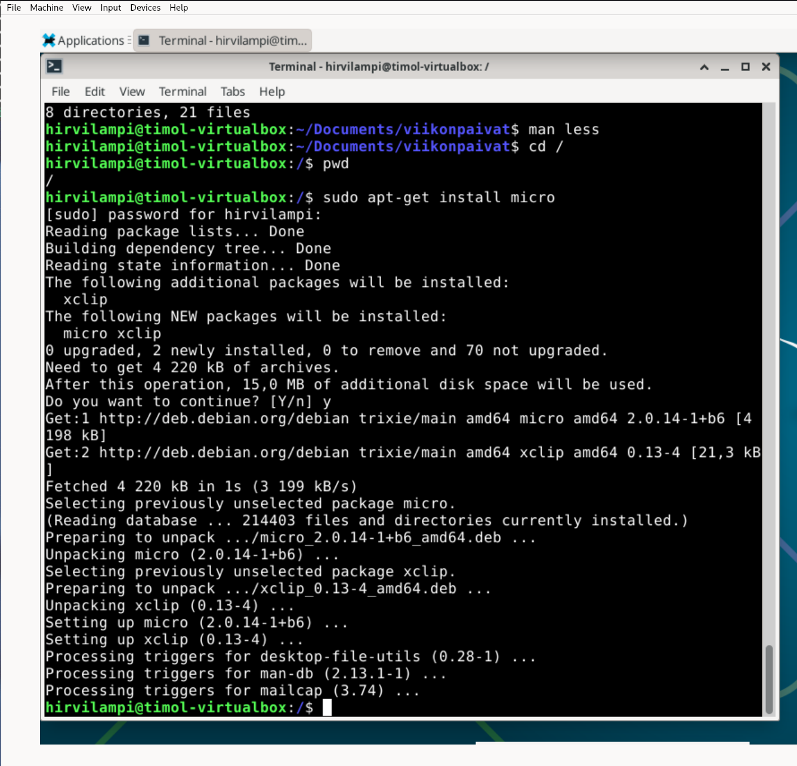
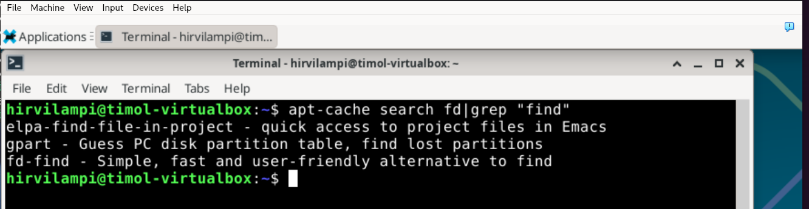
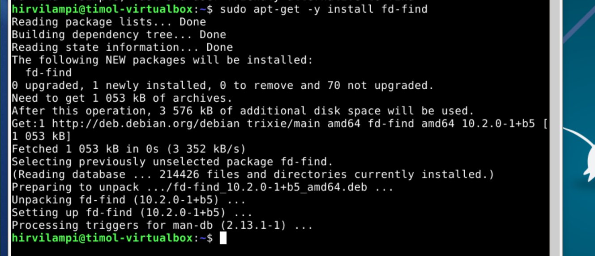
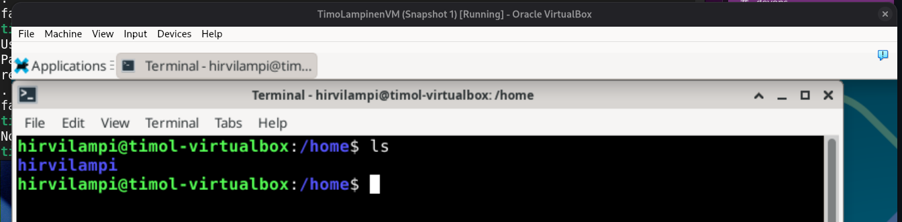
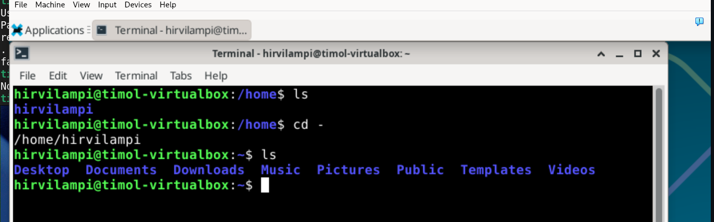
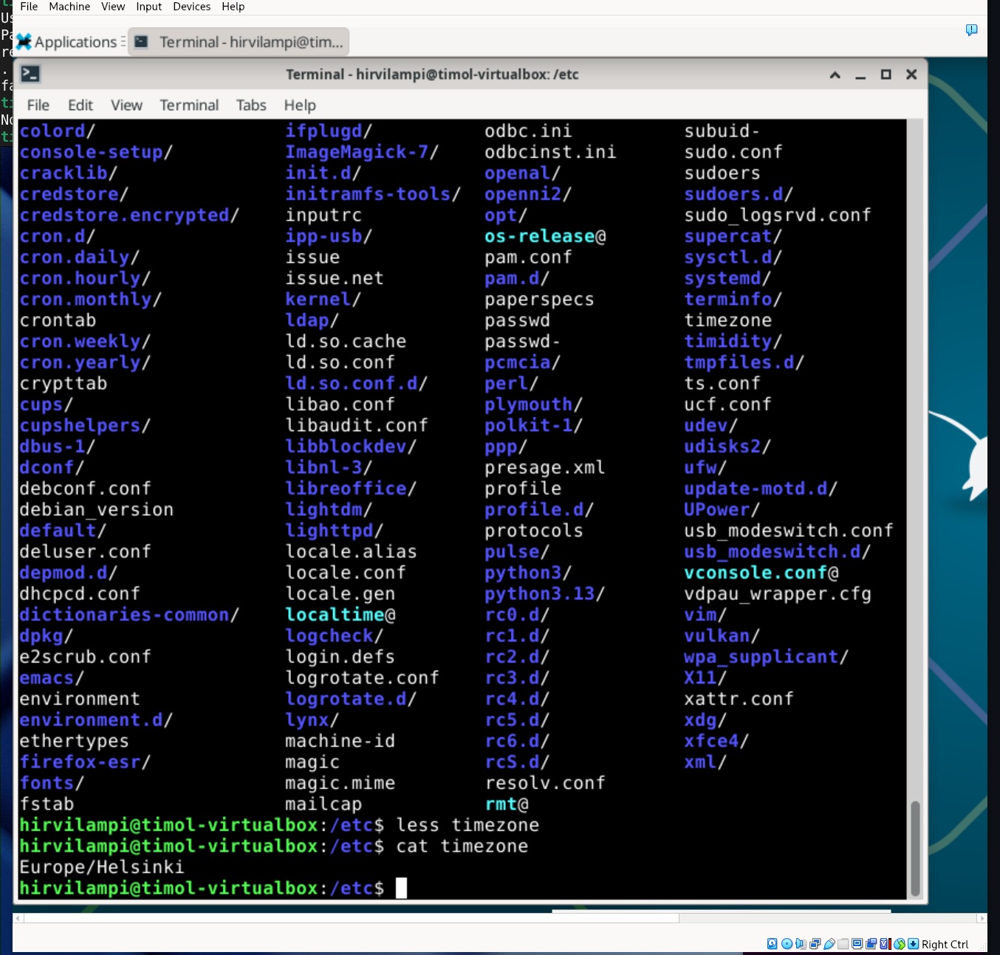
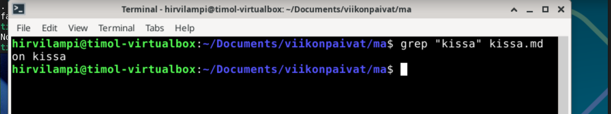
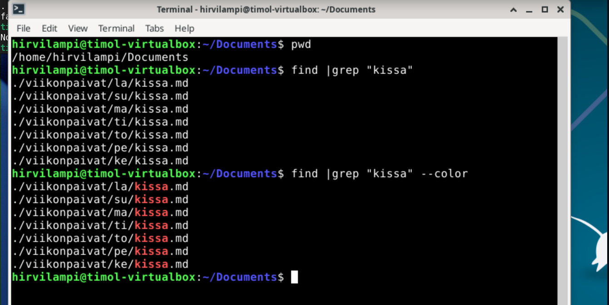

tehnyt Timo Lampinen, 2026, Linux palvelimet kurssi 

*Huomio tätä kannattaa silloin tällöin commitoida - varsinkin, jos tekee selaimessa, ettei kaikki häviä kun sulkee välilehden*

# Tehtävä: h2 Komentaja Pingviini

https://terokarvinen.com/linux-palvelimet/#h2-komentaja-pingviini

## Tiivistä - https://terokarvinen.com/2020/command-line-basics-revisited/

- uusia asia oli, että montaa kansiota voi luoda yhdellä komennolla
- mv komento oli myös uusi
- grep tulee varmasti kovaan käyttöö
- less on myös tärkeä

## Asenna Micro

Micron asennus kuvassa:

## Asenna kolme itsellesi uutta komentoriviohjelmaa

Etsin erilaisia ohjelmia ja löysin nämä:  
rolldice - nopanheitto ohjelma  
fd - kätevämpi kuulema kuin find  
fzf - sumealla logiikalla toimiva etsintä ohjelma, jolloin kaiken ei tarvitse olla täysin oikein kirjoitettu  

asennus:
sudo apt-get -y install rolldice fd fzf

fd ei asentunut, koska sitä ei löydy.

Tarkastetaan apt-cachesta grep käskyä hyödyntäen onko fd ohjelmaa olemassa

Sen nimi on ilmeisesti (tai ainakin asennuspaketin nimi on fd-find)

asennetaan

## FHS - esittele tärkeät kansiot 

### /home/   

/home/ kansiossa näkyvät kaikkien käyttäjien kansiot  

Näemme, että tänne on määritelty vain yksi käyttäjä hirvilampi  

###  /home/hirvilampi/

Käyttäjän hirvilampi kansio on paikassa /home/hirvilampi  
Tämä on tärkeä, koska tämä on ainoa paikka, jonne hirvilampi voi tallentaa tiedostoja  

### /etc/ 

Kaikki järjestelmän asetukset tiedostoina.
Tässä katsomme cat käskyllä tiedoston timezone sisällön. 

Sisältö viittaa vahvasti siihen, että tämän tiedoston sisältö: *Europe/Helsinki* kertoo järjestelmälle, mikä on koneen timezone.  

## The Friendly M - esimerkkejä grep komennon käytöstä  

etsitään tietoa kissa kissa.md tiedostosta komennolla:  
grep "kissa" kissa.md  

  

tässä jo aiemmin käytetty, kun fd ohjelmaa yritettiin etsia apt-cachesta. Oli hyvin todennäköistä, että kuvauksesta löytyisi myös find.  

etsitään viikonpäivien alta kaikki tiedostot missä mainittu kissa ja toisella kertaa merkataan se eri väriseksi  

  

## Esimerkki putkista, pipe

