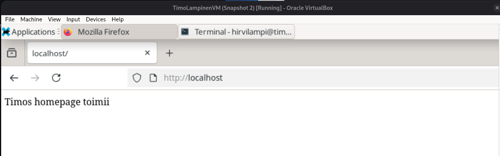
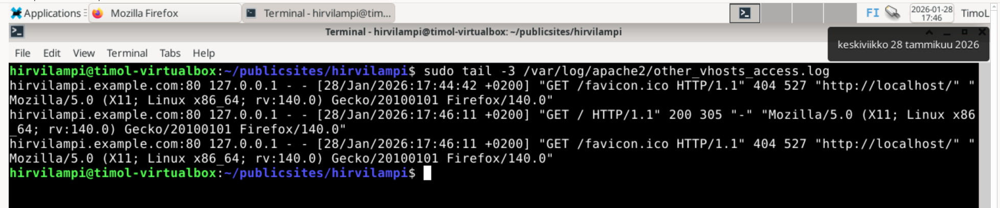
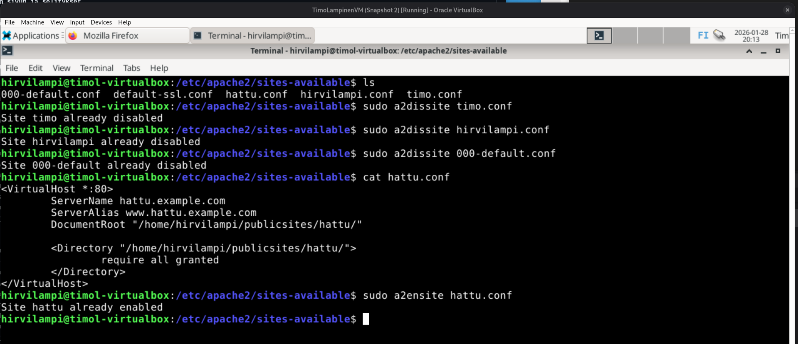
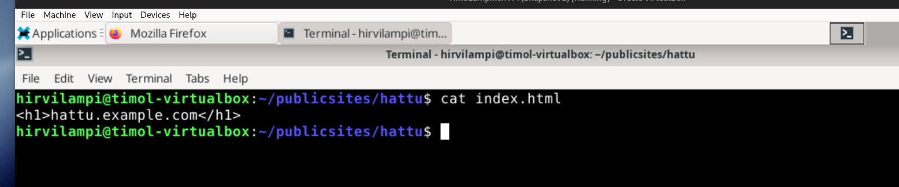
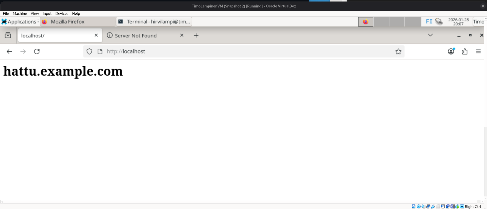
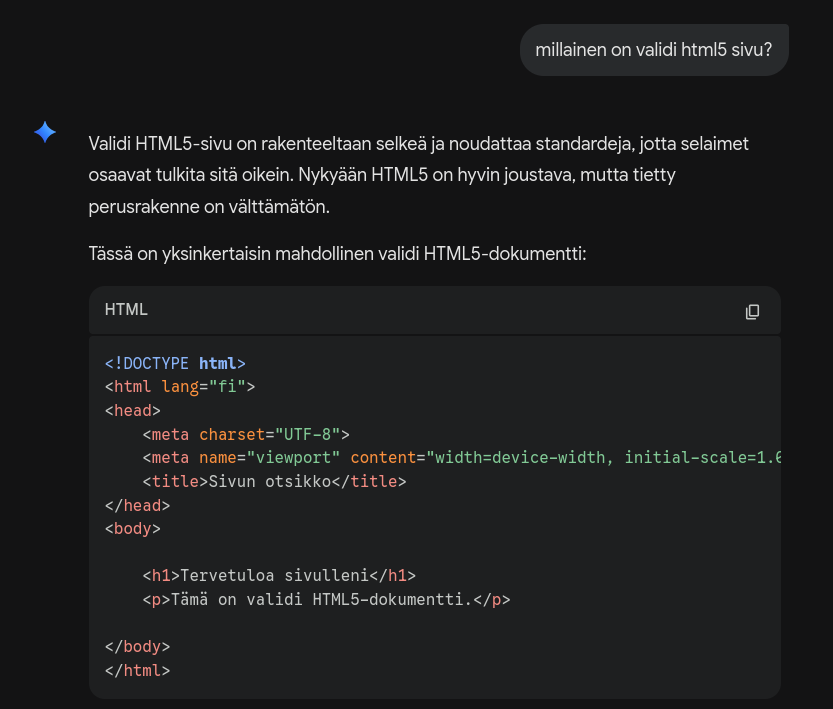
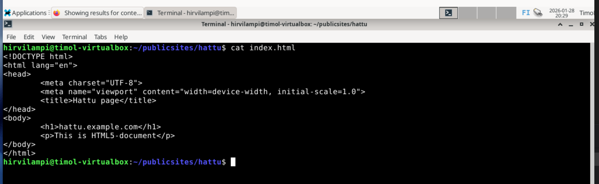
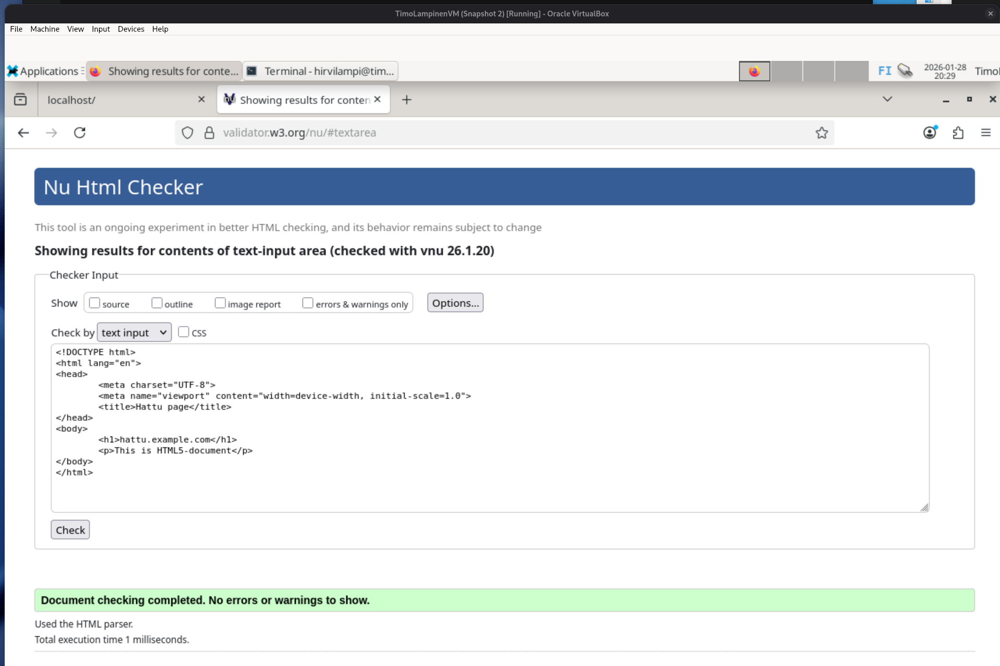
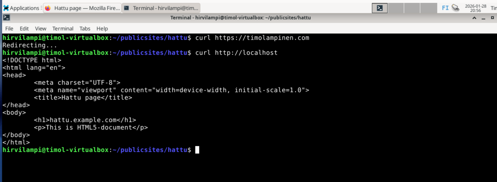
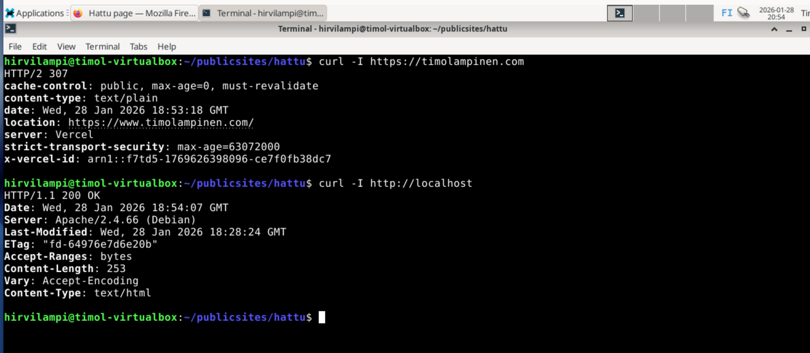

Kirjoittanut Timo Lampinen 2026
Linux-palvelimet kurssi  - ICI003AS2A-3016

Tehtävä
# h3 Hello Web Server
  
## x) Lue ja Tiivistä
  
### https://httpd.apache.org/docs/2.4/vhosts/name-based.html  

- dokumentti kertoo milloin ja kuinka käytetään: name based virtual hosts 
- mahdollistaa usean nimipalvelun toimimisen samassa ip-osoitteesta
- ensisijaisesti nimeen perustuvaa virtuaaliserveriä etsitään ip-numeron ja portin perusteella
- useamman virtuaalihostin löytyessä tehdään valinta ServerName ja ServerAlias perusteella
- jokaisessa Virtual Host lohkossa tulisi olla vähintään ServerName ja DocumentRoot
- ServerAlias on välttämätön jos haluaa saada saman sivuston näkymään useammalla nimellä  

### https://terokarvinen.com/2018/04/10/name-based-virtual-hosts-on-apache-multiple-websites-to-single-ip-address/ 

- Sivusto antaa ohjeet, kuinka montaa eri nimistä virtuaali hostia voi ajaa samasta IP-osoitteesta
- ohjeissa käytetään komentorivikehotetta 
- opetetaan asentamaan apache2 ja tekemään kaikki perusasiat siihen pisteeseen, että tehty nettisivu näyttää halutun tekstin
- ohjeissa käydään vielä läpi, kuinka paikallisesti voidaan simuloida nimipalvelun sivua  

xx a) testaa, että web palvelimesi vastaa localhost osoitteesta

  

## b) lokin rivit, kun avaat yhden sivun ja selitykset  

sudo tail -3 /var/log/apache2/other_vhosts_access.log  

  

Ladattessa näkyy kolme lokitapahtumaa,joista ajan perusteella kaksi viimeistä liittyvät viimeisimpään lataukseen.
Lähteenä:  
https://cloudlytics.com/basics-of-apache-logging-a-definitive-guide/
https://httpd.apache.org/docs/current/mod/mod_log_config.html  

ensimmäinen lokitapahtuma ajankohdalla 17:46:11
hirvilampi.example.com:80  - virtuaalipalvelin ja portti
127.0.0.1 - pyyntö menee tähän ip-osoitteeseen, eli paikallisesti   
 -   remote logname, viiva koska ei annettu
 -   remote user, if the request was authenticated, tämä myös pelkkä viiva   
[28/Jan/2026:17:46:11 +0200] - Ajankohta jolloin haettua, ja lopussa paljonko aika on eri GMT verrattuna  
"GET / HTTP/1.1" - pyyntö, haetaan etusivua  
200 305 - vastaus on onnistunut ja siinä on ollut 305 merkkiä
-    verkkosivu, jotka käyttäjä tuli tälle sivulle 
Viimeinen osio kertoo tietoja järjesestelmästä, joka suorittaa haun

toinen lokitapahtuma ajankohdalla 17:46:11  
hirvilampi.example.com:80  - virtuaalipalvelin ja portti  
127.0.0.1 - pyyntö menee tähän ip-osoitteeseen, eli paikallisesti     
 -   remote logname, viiva koska ei annettu  
 -   remote user, if the request was authenticated, tämä myös pelkkä viiva   
[28/Jan/2026:17:46:11 +0200] - Ajankohta jolloin haettua, ja lopussa paljonko aika on eri GMT verrattuna  
"GET /favicon.ico HTTP/1.1" - haetaan ikoni tiedostoa, mikä tulisi välilehtipalkkiin - mutta miksi?  
404 527 - tiedostoa ei löydy, virheilmoituksen koko on 527 tavua
"http://localhost/"  - kertoo sivun, mistä tänne tultiin  
Viimeinen osio kertoo tietoja järjesestelmästä, joka suorittaa haun

Jäin miettimään miksi /favicon.ico tiedostoa haetaan. Löysin kuitenkin ratkaisun tältä sivulta:  
https://www.reddit.com/r/webdev/comments/o0irdx/can_someone_help_me_understand_why_when_i_run/
"Favicon is the little emblem at the top of your browser, like the badge that some sites have. Without one in your project folder your browser can't find one and throws an error. You can always make one there's plenty of favicon generators for free online. "  
Ongelma tämän mukaan on siinä, että selain hakee sitä ja koska tiedostoa ei löydy, saan kyseisen virheilmoituksen.   
Tässä hiukan Favicon historiaa Wikipediasta: https://en.wikipedia.org/wiki/Favicon  

## c) Etusivu uusiksi 

Seurasin sivun https://terokarvinen.com/2018/04/10/name-based-virtual-hosts-on-apache-multiple-websites-to-single-ip-address/  
ohjeita. Tämän lisäki oppitunnin 27.1.2026 muistilistaa.

Tein etusivun hattu.conf tiedoston ja muut .conf tiedostot asetin pois päältä.  
  

index.html tiedosto  
  

  
Tässä lopputulos: 
  

  
## e) Tee validi html5 sivu

En Löytänyt jotain selkeää ohjetta. Jotain kysyin geminiltä: "millainen on validi html5 sivu?" 
Alla vastauksen alkuosa ja päätin kokeilla mukana tullutta koodiehdotusta  

  
  
index.html html5 sivuna
  

Koska tekoäly ei ole aina luotettava, päätin käyttää syntyneen koodin validaatiopalvelun kautta.  
Käyttämäni palvelu oli:  https://validator.w3.org/#validate_by_input
 

Ei tämä varmaankaan täysin väärin ole.  

## f) Anna esimerkit curl -l ja curl kommennoista ja selitä response headereista, mitä ne tarkoittavat

curl - kokeiltiin localhostiin sekä omaan portfolioon sivulla www.timolampinen.com

  

curl lähettää koko sivun sisällön. www.timolampinen.com tapauksessa näemme vain *Redirecting..*  
Tämä johtuu todennäköisesti siitä, että se ohjataan palvelimelta toiselle, sillä varsinaiset sivuni pyörivät vercelin alla.  

curl -I kokeiltiin localhostiin sekä sivulla www.timolampinen.com

  

https://www.timolampinen.com  
HTTP/2 307 Tarkoittaa väliaikaista uudelleenohjausta    
cache-control: ohjeistaa miten sivua saa tallentaa välimuistiin. Tässä tapauksessa selain ei saa käyttää vanhaa tallennetta tarkistamatta onko uusi saatavilla  
content-type: määrittelee minkätyyppistä sisältö on. Tässä pelkkää tekstiä  
date: haun ajankohta  
location: haun url  
server:  käytetty serveri, tässä tapauksessa pilvialusta Vercel  
strict-transport-security: kertoo, että kahden vuoden (max-age) sisällä tulee olla vain https yhdeyden kautta  

http://localhost  
HTTP/1.1 200 OK  Tämä on onnistunut pyyntö ja sen vakioilmoitus  
date: haun hetki  
server:  serveri jolla pyörii, eli tässä Apache  
Last-Modified: aika, jolloin tiedostoa on viimeksi muokattu  
ETag: yksilöllinen tunniste (hash) tiedoston versiolle  
Content-Length: vastauksen koko tavuina  
Content-Type: mitä tyyppiä, tässä tekstiä ja html:ää  

## m) Hanki GitHub Education paketti
- Hankittu vuosi takaperin

## 
  
## Lähteet
Basics of Apache Logging: https://cloudlytics.com/basics-of-apache-logging-a-definitive-guide/  
Apache Module mod_log_config: https://httpd.apache.org/docs/current/mod/mod_log_config.html 
Reddit: https://www.reddit.com/r/webdev/comments/o0irdx/can_someone_help_me_understand_why_when_i_run/  
validaatio palvelun w3 validator kautta: https://validator.w3.org/#validate_by_input
AI Gemini3, kysymys 28.1.2026: "millainen on validi html5 sivu?"

