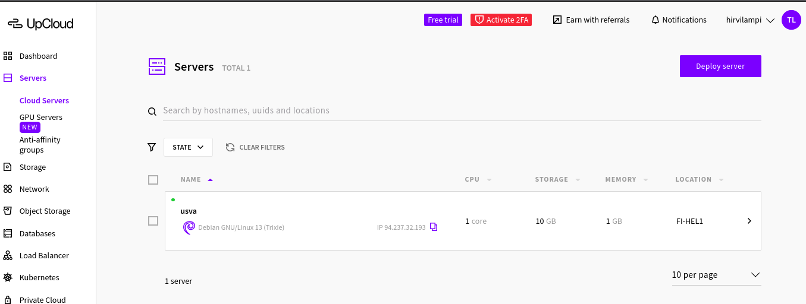
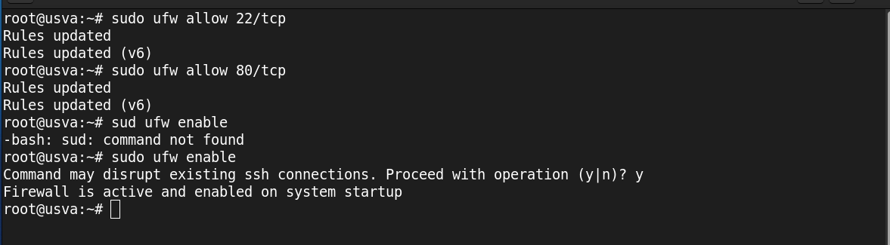
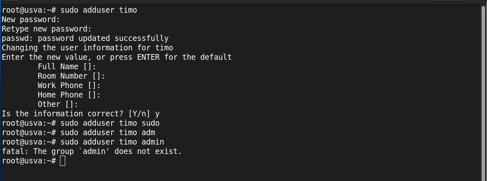
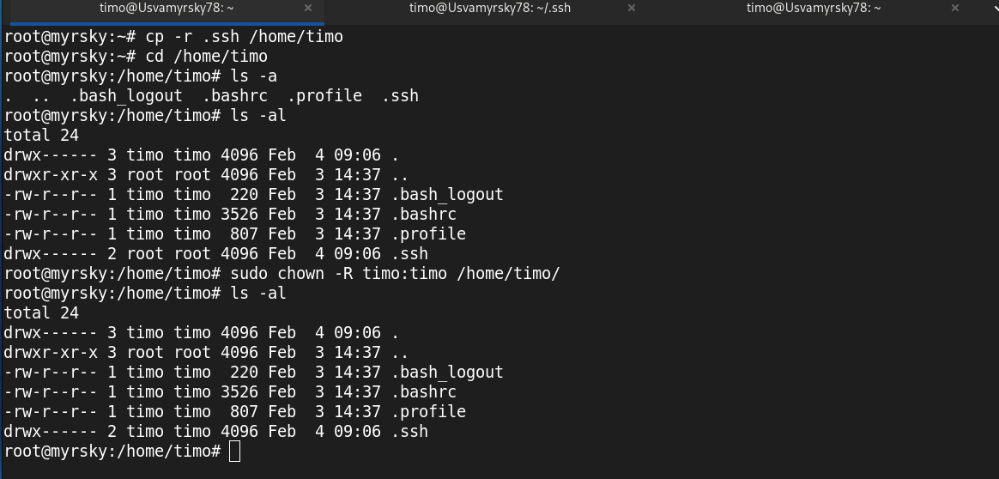
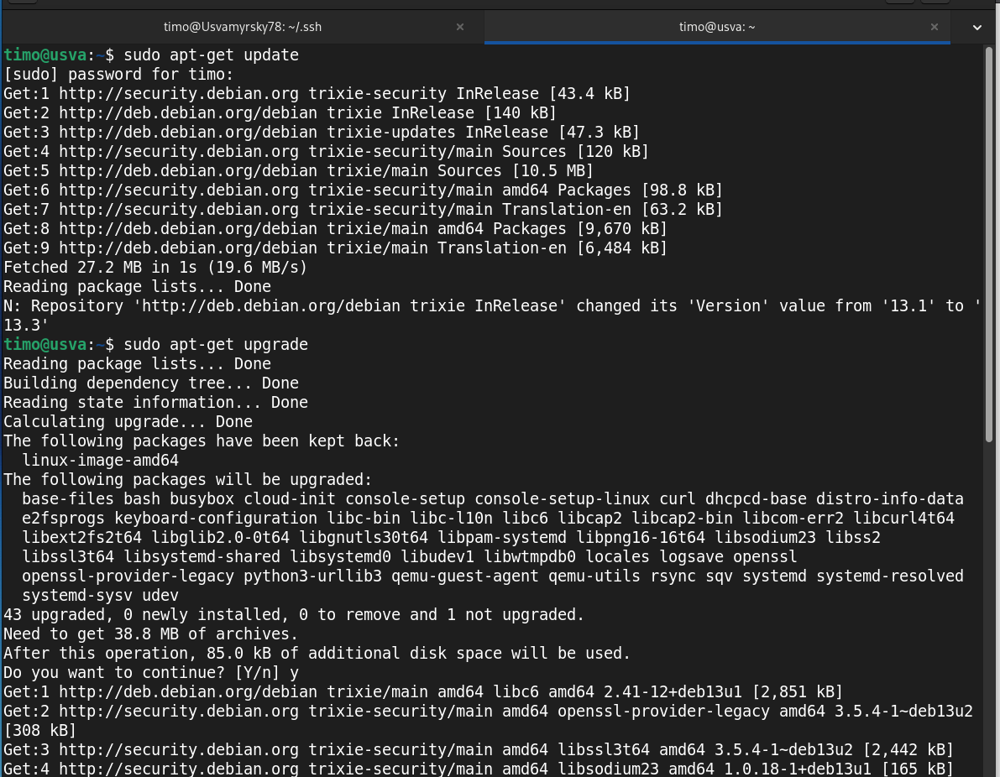

Kirjoittanut Timo Lampinen 2026  
Linux-palvelimet kurssi - ICI003AS2A-3016  
Tehtävä h4 sivulta: https://terokarvinen.com/linux-palvelimet/  

# h4 Maailma kuulee - tehtävä  

## Tiivistys Susanna Lehdon blogipostauksen tietyistä kohdista 
Lehto 2022: https://susannalehto.fi/2022/teoriasta-kaytantoon-pilvipalvelimen-avulla-h4/  

a) Pilvipalvelimen vuokraus ja asennus  
- Lehto kertoo vuokranneensa pilvipalvelun Linux-palvelimet kurssia varten DigitalOceanilta ja domainin Namecheapilta, koska sai Github:n kautta ne ilmaiseksi.
- Lehto käy läpi yksityiskohtaisesti vaihe vaiheelta tilin luomisen ja maksukorttitietojen lisäämisen.
- Itse virtuaalipalvelimen luomisen Lehto käy kohta kohdalta läpi ja tapa on hyvin samanlainen, mitä 3.2.2026 Teron Linux-palvelimien tunnilla käyty virtuaalipalvelimen luonti UpCloudiin.
- Lopuksi Lehto käy läpi domaninimen vuokraamisen namecheapilta ja domainnimen yhdistämisen virtuaalipalvelimelle

*b ja c kohdista ei haluttu tiivistystä ja ne olivat vaihtoehtoja kohdalle a*  

d) Pavelin suojaan palomuurilla  
- Lehto selittää käskyt millä ensiksi siirrytään pavelimelle ja todentää nämä terminaalista otetuilla kuvilla
- Myös järjestelmän päivitys ja palomuurin asentaminen on katettu käskyillä ja terminaalin kuvilla
- Lopuksi palomuuri asetetaan päälle

e) Kotisivut palvelimelle  
- Aluksi Lehto selittää tehtävän ja sen tavoitteen, eli asentaa apache-webbipalvelin ja korvata testisivu käyttäjän kotisivulla
- Lehto käy läpi uuden käyttäjän luomisen ja antaa tälle tarvittavat pääkäyttäjän oikeudet ja testaa toimiiko oikeudet
- Tämän jälkeen hän lukitsee juuren (#root)
- Uuden käyttäjän kirjautumisen jälkeen hän asensi apache palvelimen ja teki reiän palomuuria varten
- Lehto muutti apachen oletustiedostoa ja konfiguroi omat tiedot palvelun toimimista varten
- Apachen uudelleenkäynnistyksen jälkeen hän teki yksinkertaiset kotisivut
- Koska kaikki vaiheet olis suoritettu onnistuneesti, näkyi tehty nettisivu juuri siinä paikassa mihin tieto oli asetettu
- Koko prosessin kaikki vaiheet kuvattiin terminaalista ja näytöstä otetuilla kuvakaappauksilla  

f) Palvelimen ohjelmien päivitys  
- Lehto kertoo, että tehtävän hän suoritti käyttämällä kolmea erilaista päivityskomentoa:
*sudo apt-get update, sudo apt-get upgrade, sudo apt-get dist-upgrade)
- Näillä hän sai myös kaikki uusimmat tietoturvapäiviytkset

## a) Vuokraa oma virtuaalipalvelin 

Vuokrasin oman virtuaalipalvelimen UpCloudilta.  

  

## b) Alkutoimet virtuaalipalvelimella  

logataan sisään:  

*ssh root@94.237.32.193*

### Tulimuuri (firewall) päälle 

  *sudo apt-get install ufw*  - Aloitetaan istanlloimalla ufw käskyllä

  *sudo ufw allow 22/tcp*  - Tehdään SSH reikä ensin  
  
  *sufo ufw allow 80/tcp*  - Toinen reikä  

  *sudo ufw enable* - Tulimuuri päälle  

  
 

### Root tunnus kiinni  

Tehdään uusi käyttäjä ja annetaan hänelle pääkäyttäjän oikeudet

  *sudo adduser timo* - lisää käyttäjän  
  *sudo adduser timo sudo* - lisää käyttäjän ryhmään sudo  
  *sudo adduser timo adm* - lisää käyttäjän ryhmään adm  
  *sudo adduser timo admin* - lisää käyttäjän ryhmään admin  
  admin ryhmää ei ole, joten se tuottaa virheen

  

Kopioi SSH-avain käyttäjälle timo  

*cp -r .ssh /home/timo* - kopioidaan .ssh kansio timo käyttäjän kotihakemistoon
*sudo chown -R timo:timo /home/timo/* - tehdään .ssh kansiosta timo käyttäjän kansio

  

Testaa toisessa terminaalissa, että toimii

  *ssh timo@94.237.32.193* 

  

Lukitse root account  

  *sudo usermod --lock root*  - lukitsee salasanan  
  Vanhassa ohjeessa oli sshd_configin muuttamista, mutta päätin lopettaa kesken ja tarkastella muita ohjeita.  
  *sudo mv -nv /root/.ssh /root/DISABLED-ssh/* - siirretään ssh avain paikkaan, mistä järjestelmä ei kirjautuessa sitä löydä    

  

### Ohjelmien päivitys

Päivitä ohjelmat käskyillä: 

  *sudo apt-get update*  
  *sudo apt-get upgrade*  

  

Päivityksiä oli paljon ja kaikki sujui ongelmitta.  

## c) Asenna weppipalvelin omalle virtuaalipalvelimellesi. Korvaa testisivu

## Lähteet

Lehto 2022: https://susannalehto.fi/2022/teoriasta-kaytantoon-pilvipalvelimen-avulla-h4/  
Karvinen 2017: https://terokarvinen.com/2017/first-steps-on-a-new-virtual-private-server-an-example-on-digitalocean/  

