Kirjoittanut Timo Lampinen 2026  
Linux-palvelimet kurssi - ICI003AS2A-3016  
Tehtävä h5 sivulta: https://terokarvinen.com/linux-palvelimet/  

# Tehtava H5 Nimekäs

## a) Nimi. Laita julkinen nimi osoittamaan omaan koneeseesi.  
  
Hankin nimen bonakota.com NameCheapin kautta. Nimeksi valitsin tuon, koska teen yhtä projektia tuolla  
nimellä.  

  
  
   

    

Menin omaan accountiin ja sieltä domain list kohtaan sivupalkista.  
Täällä näemme bonakota.com ja valitsemme manage.  
  
    

Menin suoraan Advanced DNS välilehdelle ja poistin vanhat recordit.  
Kuvassa näkyy tyhjä record lista.  

    

Tämän jälkeen lisäsin kaksi a-record, host ja value ja päivitysnopeus välimuistiin.

    
  
Kopioin vanhan timo.example.com.conf pohjaksi bonakota.conf tiedostolle ja muokkasin siihen oikeat tiedot.  
Tämän jälkeen poistin vanhan .conf käytöstä, otin uuden käyttöön ja käynnistin apache2:n uudestaan.

  

Sivu alkoi heti näkymään netissä osoitteessa bonakota.com  

    

Kokeilin myös kännykällä ja sivu näkyy siellä samalla tavalla. 
Lisäksi kokeilin www.bonakota.com ja se toimii myös.  

## b) Alidomain. Tee kaksi uutta alidomainia.  

### A-tietueen alidomain 

Tein uuden alidomainin domain list:n kautta bonakota.com Namecheapin kautta. 
Tämä tehtävän mukaisesti A Record:a käyttäen.  Uuden alidomainin nimi on try.bonakota.com

 

Tämä ei varmaankaan vielä toimi näin, mutta testataan:  

 

Ei toiminut. Pitänee lisätä try.bonakota.com .conf tiedostoon.  

 

Tämäkään ei auta ja virheilmoitus on sama kuin aiemmin.  
Ehkä kuitenkin on syytä etsiä jokin lähde, missä asia selitetään paremmin.  
Lähteeksi löytyi: https://www.eksis.one/artikkelit/apache2/apache2-ja-alidomain/

Sivujen erottamiseksi toisistaan, haluan tehdä sivulle oman index.html tiedoston.  
Tehdään ensin uusi hakemisto polkuun  
*/home/timo/publicsites/*  ja lisätään sinne *index.html*    

 
 

Käydään sen jälkeen luomassa uusi try.bonakota.conf tiedosto ja laitetaan se päälle.  

 
 

testataan  

 

Hemmetti - eihän tämä toimi vieläkään. 
Selaimen konsolista ei myöskään ollut suuresti apua.  

 

Tutkin lisää ja tarkemmin lähdesivua.  
try.bonakota.com pitääkin määritellä ServerName, eikä alias. Se siis tarvitsee oman .conf tiedoston.  
Vaihtoehtoisesti sen voisi lisätä bonakota.conf tiedoston perään omana uutena VirtualHost:na, mutta  
oma try.bonakota.conf tiedosto mahdollistaa virtualhostien ensite ja dissite tekemisen erikeen. 
 
Poistin try.bonakota.com tiedostosta serveraliaksen ja muokkasin *ServerName try.bonakota.com*   

 
 
 

Tämä alkoi toimimaan. Vihdoinkin. 

Miksi näin? Tulin siihen tulokseen, että try.bonakota.com täytyy olla omana ServerName määritelty,  
koska se osoittaa omaan hakemistoon. Mikäli try.bonakota.com osoittaisi samaan hakemistoon kuin  
bonakota.com, silloin se voisi olla määritelty ServerAliaksena. Tämä käy järkeen, sillä ServerName ja
ServerAlias on osoitettava samaan polkuun.  
Päättelyn lisäksi on löysin saman tiedon myös Apachen dokumentaatiosta:  
https://httpd.apache.org/docs/current/vhosts/name-based.html?utm_source=chatgpt.com

Mielenkiinoinen yksityiskohta.  Apache lukee .conf tiedostot aakkosjärjestyksessä, joten jos aiemmin  
aakkosjärjestyksessä olevasta lokista löytyy etsintään kelpaava vastaus, se käytetään ja näytetään.  
Tämän vuoksi default loki on nimeltään 000-default.conf.  On siis tärkeää muistaa tämä jatkossa, jos  
VirtualHost:ja on käytössä enemmänkin.

### CNAME alidomain. 

CNAME eroaa A Recordista siten, että siinä DNS tunnusta käytetään aliaksena toisella domain nimelle.
Tämä eroaa A Recordista käytännössä niin, että samalla kun A Record laitetaan osoittamaan suoraan  
IP osoitteeseen (kuten 185.20.138.164), laitetaan CNAME osoittamaan domain nimeen (bonakota.com).  

CNAME suurin hyöty on yksinkertaistaa kokonaisuuden hallintaa 

Lähde: https://dnsmadeeasy.com/resources/cname-records-explained  

Lisäsin CNAME tiedon DNS tietoihin nimipalvelussa ja bonakota.conf tiedostoon ServerAliakseksi.

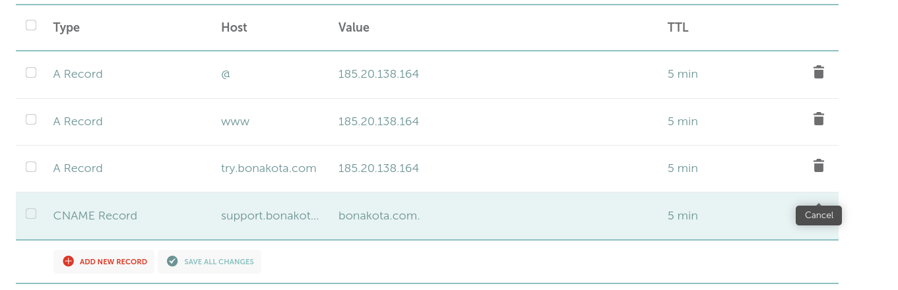 
 

Tässä minulla oli hiukan haasteita, koska samalla tietokoneella sivu ei auennut. Kokeilin kännykkää ja toista konetta, 
niillä sivu latautui. Lopulti yli tunnin jälkeen kuva avautui myös omalla koneella. 

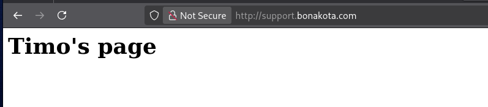 

  

## c) Tutki jonkin nimen DNS tietoja host ja dig komennoilla  

  
Analysoidakseni enemmän tietoa hain netistä artikkelia, joka kertoisi näiden eroista. Löysin tämän nettisivun  
https://avenacloud.com/blog/using-dig-and-host-commands-for-dns-troubleshooting/#   
Nettisivu avaa hienostie molempien komentojen erosta.  Ero on selkeä ja sen voi tiivistää näin:  
*dig* antaa enemmän vaihtoehtoja ja yksityiskohtaiseen analyysiin, kun taas  
*host* tarjoaa nopeutta ja helppoutta.  

Kokeilin molempia ensin omaan timolampinen.com osoitteeseen, joka on ollut käytössäni jo vuosia.  

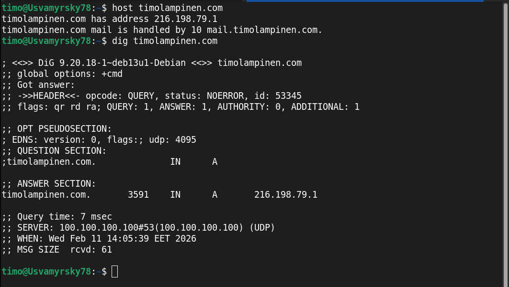

Host kertoo, että palveluni on löytyy osoitteesta 216.198.79.1 ja sähköpostipalvelimen mail.timolampine.com nimen.  
Dig taas antaa heti paljon enemmän tietoa, kuten kuinka kauan kestää, että tieto sivusta päivitettään eli TTL tieto. TTL on 3600 sekuntia.  
A tietue, eli IPv4 osoiteavaruus ja IP-osoite 216.198.79.1 
Tämän lisäksi DIG palauttaa paljon tietoa itse kyselystä, kuten kestosta, ajasta ja vastauksen koosta.  

Minua kiinnostava välihuomio:  
Itseasiassa minulla on nimipalvelu ja webbihotelli samasta paikasta, mutta tein uuden nettisivut ja laitoin projektin verceliin. 
Nimipalvelu ohjaa kyselyt suoraan vercelin osoitteeseen 216.198.79.1. Aiemmin käytetyn nettihotellin IPv4 osoitetta ei näy ollenkaan. 
Näin sen pitääkin toimia.  Tämä kertoo myös minulle sen, että voin aivan hyvin luopua tuosta webbihotellista.  

Pureudutaan tarkemmin molempiin komentoihin.   

### HOST -komento

Käydään läpi tarkemmin komentojen antamia tietoja. Host antaa enemmän tietoa -v parametrilla. Kokeillaan siis:  
*host -v timolampinen.com*  

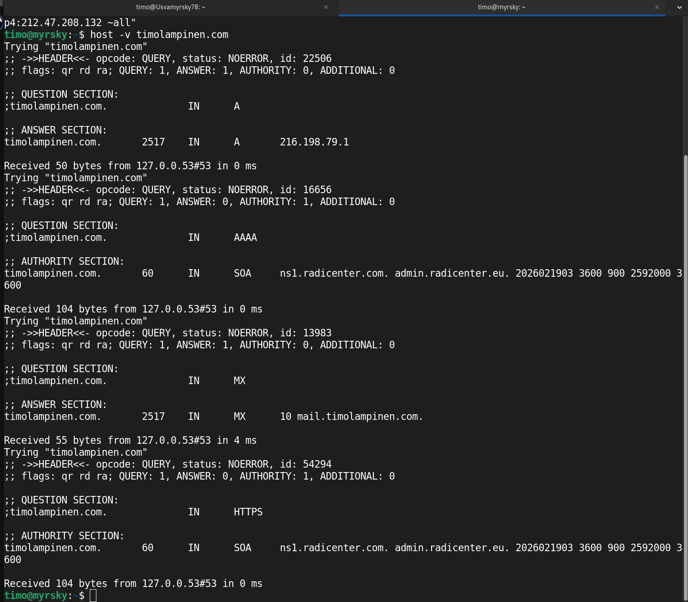  

Header kertoo headerissa kyselyn perustiedot ja onnistuiko kysely vai ei.

Question osuus kertoo aina mitä kysytään ja Answer vastauksen.  

timolampinen.com IN A - kysyy IPv4 osoitetta   
vastauksena 2847 IN A 216.198.79.1  
TLL arvo on 2847, eli tämä pysyy välimuistissa 2847 sekuntia, ennen kuin se tarkastetaan uudelleen.  
216.198.79.1 on IPv4 osoite  

timolampinen.com IN AAAA - kysyy IPv6 osoitetta
Headerissa ANSWER: 0, kertoo ettei kysymykseen löytynyt suoraa vastausta ja palautta SOA vastauksen   
SOA (Start of Authority) kertoo pavelimen, joka hallistee verkkotunnusta eli ns1.radicenter.com  
TTL arvo 60, kertoo että tieto pysyy välimuistissa 60 sekuntia  

timolampinen.com IN MX - kysyy sähköpostipalvelinta  
vastauksena mail.timolampinen.com  
TLL arvo on 2847, eli tämä pysyy välimuistissa 2847 sekuntia  

timolampinen.com IN HTTPS - kysyy HTTPS DNS tietuetta  
Headerissa ANSWER: 0, kertoo ettei saa vastausta ja palauttaa SOA:n  
SOA (Start of Authority) kertoo pavelimen, joka hallistee verkkotunnusta eli ns1.radicenter.com  
TTL arvo 60, kertoo että tieto pysyy välimuistissa 60 sekuntia  

lähteet: https://phoenixnap.com/kb/linux-host   
https://www.hacktress.com/what-is-host/   

Verrataan timolampinen.com, keyframe.fi ja youtube.com host tietoja keskenään:17

  
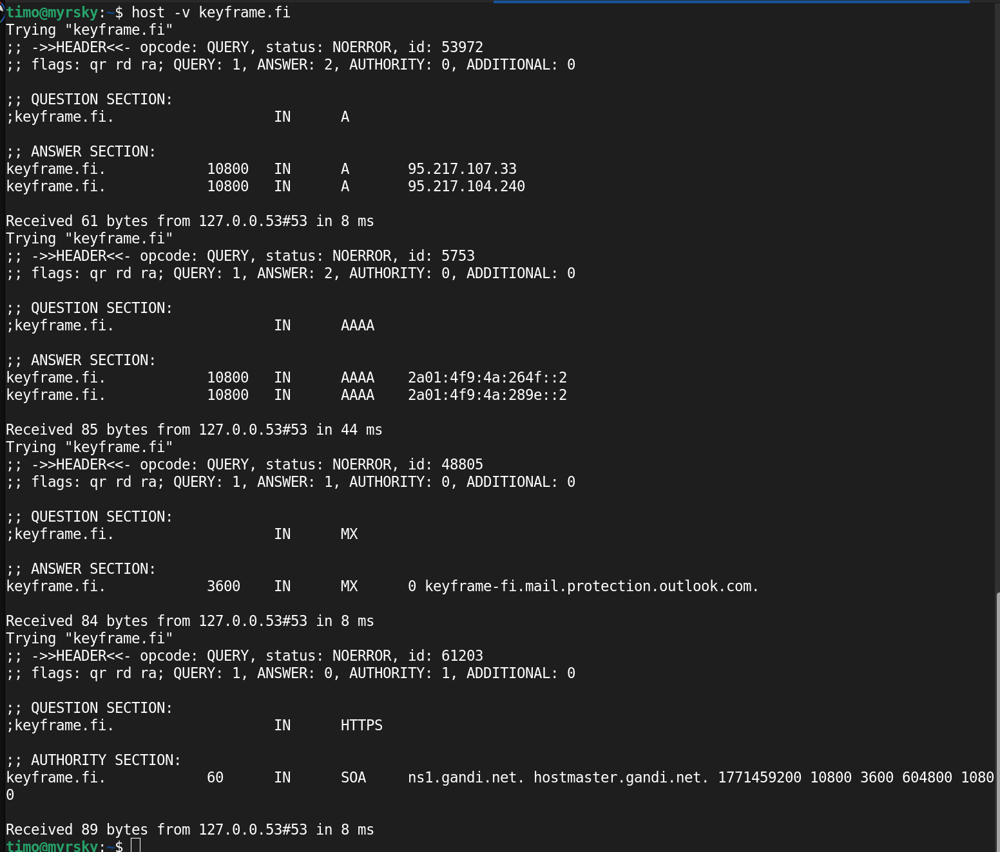  
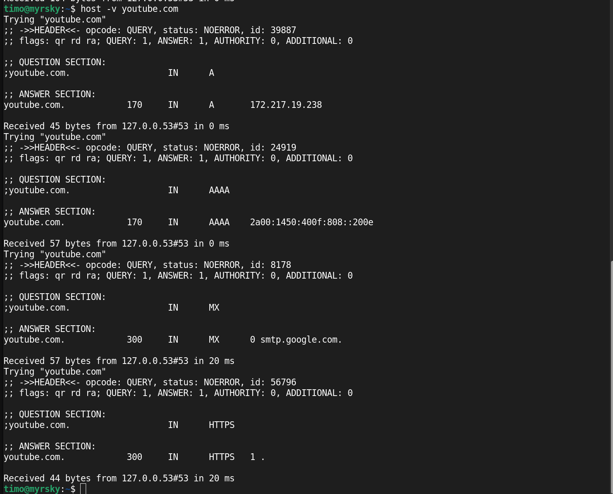  

IPv4 (A) ja mail-server (MX) kyselyt tuottavat kaikista osoitteista tulokset.  
Isoimmat erot huomaamme koskien IPv6 kyselyn (AAAA) ja HTTPS kyselyn tuloksia katsoen.  
timolampinen.com ei  ole määrittellyt IPv6 (AAAA) eikä HTTPS tietoa.
keyframe.fi löytyy IPv6 (AAAA) osoite, mutta ei HTTPS-tietoa.  
youtube.com sen sijaan antaa vastaukset kaikkiin näihin.  

### DIG-komento ja sen antamat tiedot.

lähde: https://phoenixnap.com/kb/linux-dig-command-examples  

Kokeillaan perus dig käskyä parametreilla timolampinen.com ja youtube.com  

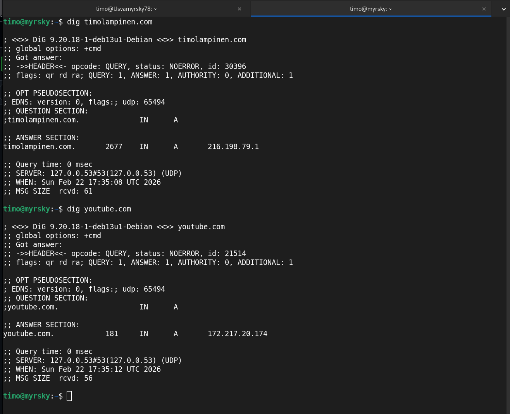  

Vastauksissa ei ole oleellista eroa. Answer section näyttää samalta kuin Host komennossa, mutta näyttää vain IPv4 osoitteen.

Tämä komento sen sijaan näyttää vielä enemmän tietoa.
*dig timolampinen.com ANY +all*  

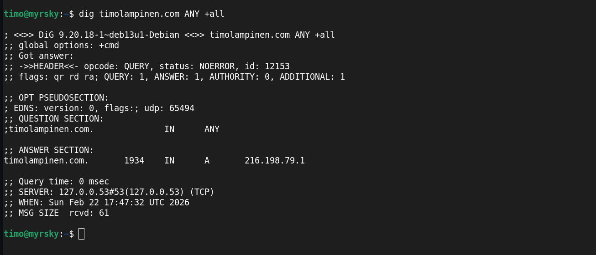  

Tästä emme kuitenkaan saa irti enempää tietoa, kuin mitä nimipalvelin käskyllä lähettää.  

Ajetaan sama keyframe.fi osoitteelle  
*dig keyframe.fi ANY +all* 

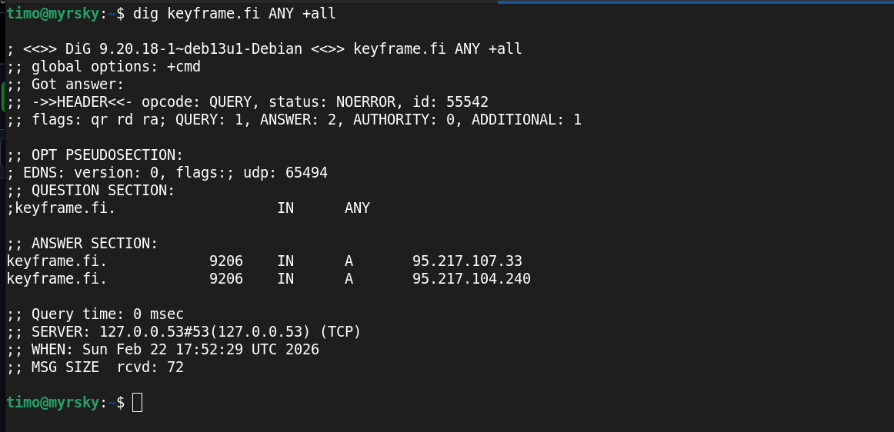  

Tämä antaa hiukan enemmän tietoa, eli kaksi eri IPv4-osoitetta.

Ajetaan sama youtube.com osoitteelle  
*dig youtube.com ANY +all*  

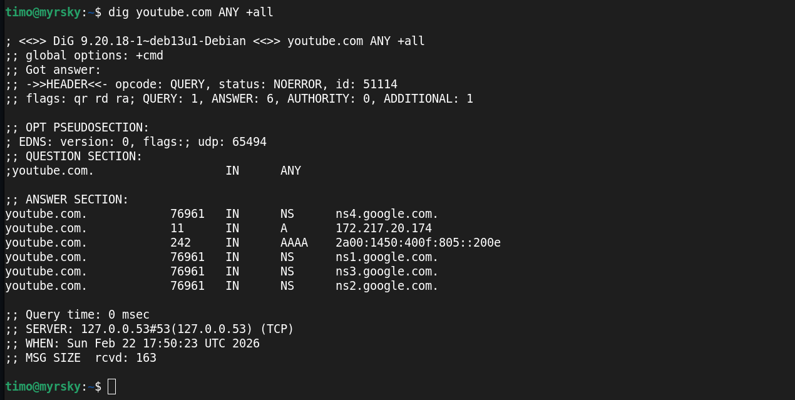  

Youtuben ollessa kyseessä, näemme myös usean nimipalvelimen.  
Kuitenkaan, emme näe tietoa tietoa esimerkiksi MX, HTTPS tai SOA tietoja.  

Näitä voi myös digiä käyttäen hakea, kun laittaa nuo parametriksi.  

*dig youtube.com HTTPS SOA MX +all*

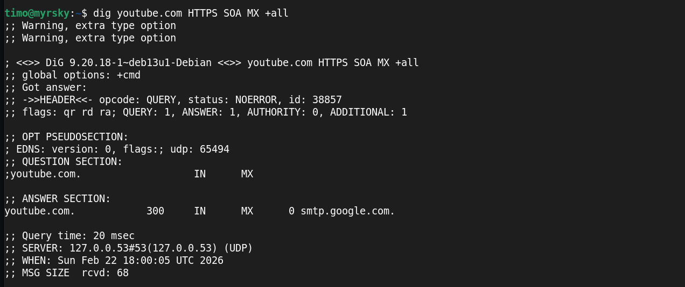  

Outoa. Tämä antaakin vain sähköpostipalvelimen.  
Kokeillaan eri komentoja, jos näistä tulisi enemmän tietoa:  

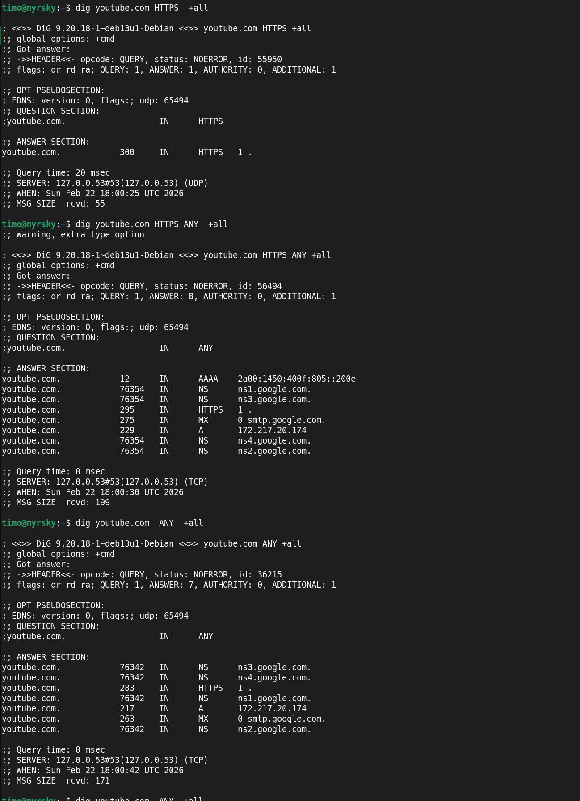  

No nyt saadaan näkymään myös MX, HTTPS js NS.  Tässä mielenkiintoista on, että nyt  
*dig youtube.com ANY +all* näyttää enemmän tietoa kuin aiemmin. 

*dig* komennolla voi tehdä kaikenlaista, mutta jätetään syvemmälle meneminen jokaisen omaan tiedonhankinnan piiriin.  
Osion alussa mainittu lähde on erinomainen tähän.

## Lähteet  

EksisONE 2012: https://www.eksis.one/artikkelit/apache2/apache2-ja-alidomain/  
Apache: https://httpd.apache.org/docs/current/vhosts/name-based.html?utm_source=chatgpt.com
Lähde: https://dnsmadeeasy.com/resources/cname-records-explained  
https://phoenixnap.com/kb/linux-host   
https://www.hacktress.com/what-is-host/   
https://avenacloud.com/blog/using-dig-and-host-commands-for-dns-troubleshooting/#   

