Kirjoittanut Timo Lampinen 2026  
Linux-palvelimet kurssi - ICI003AS2A-3016  
Tehtävä h5 sivulta: https://terokarvinen.com/linux-palvelimet/  

# Tehtava H5 Nimekäs

## a) Nimi. Laita julkinen nimi osoittamaan omaan koneeseesi.  
  
Hankin nimen bonakota.com NameCheapin kautta. Nimeksi valitsin tuon, koska teen yhtä projektia tuolla  
nimellä.  

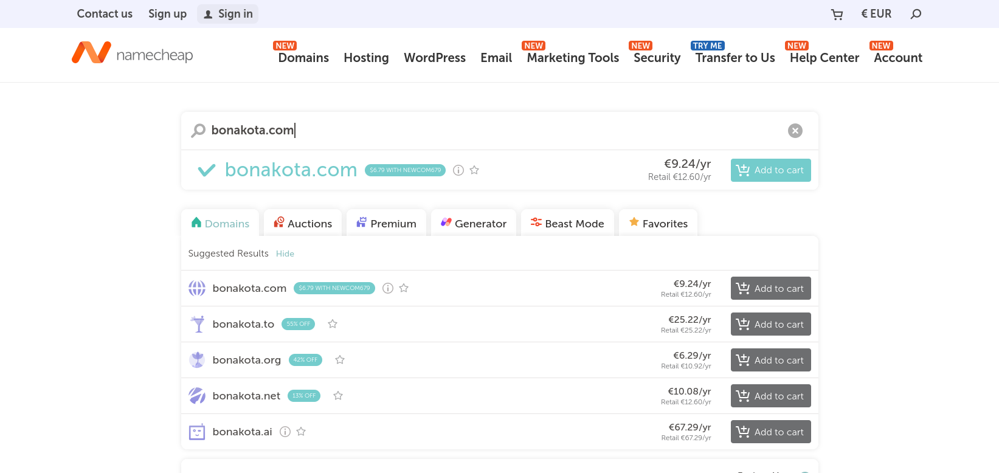  
  
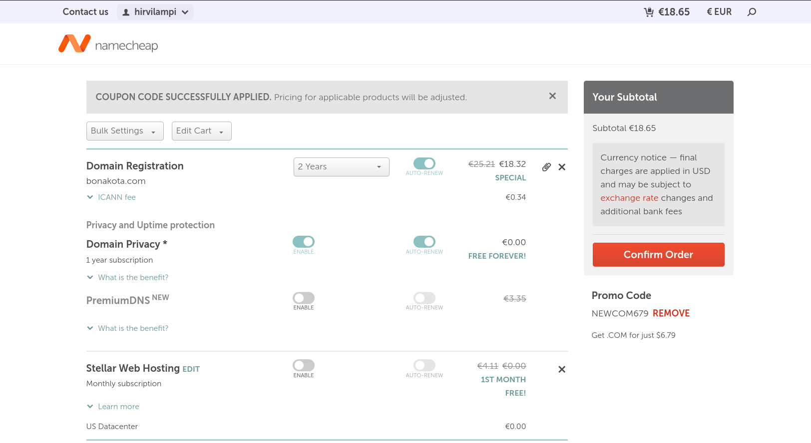   

  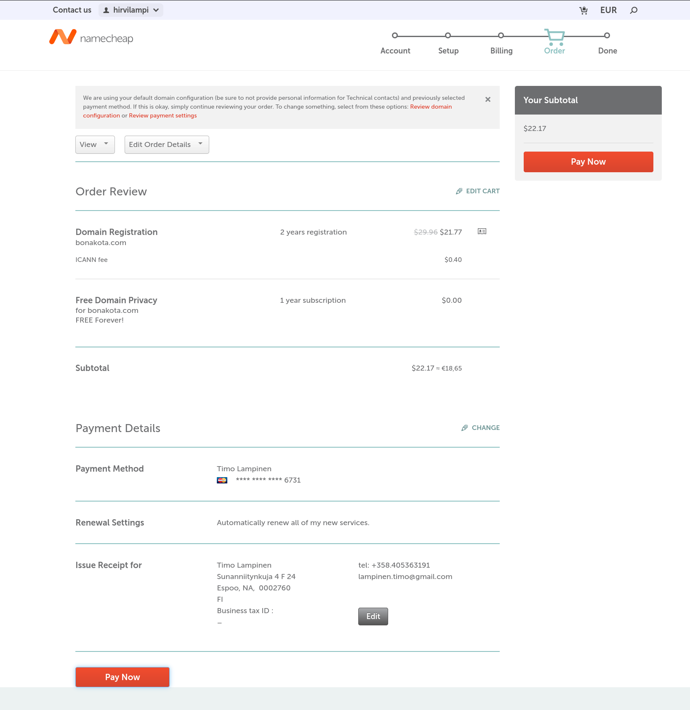  

Menin omaan accountiin ja sieltä domain list kohtaan sivupalkista.  
Täällä näemme bonakota.com ja valitsemme manage.  
  
  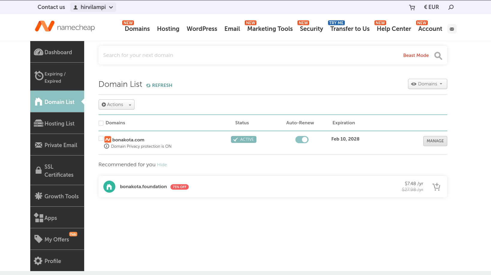  

Menin suoraan Advanced DNS välilehdelle ja poistin vanhat recordit.  
Kuvassa näkyy tyhjä record lista.  

  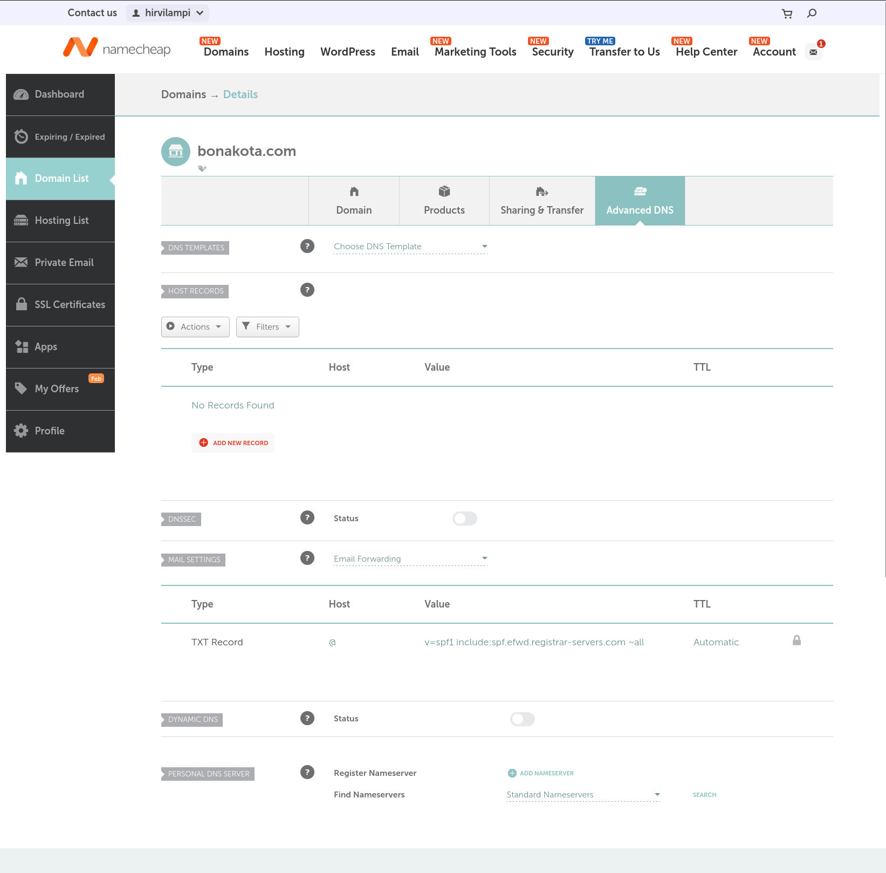  

Tämän jälkeen lisäsin kaksi a-record, host ja value ja päivitysnopeus välimuistiin.

  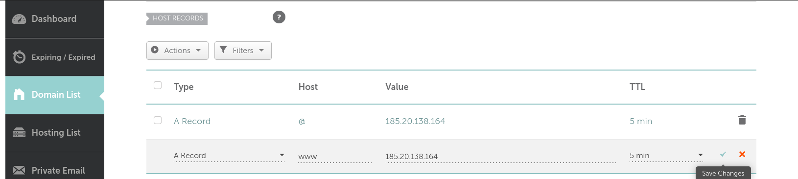  
  
Kopioin vanhan timo.example.com.conf pohjaksi bonakota.conf tiedostolle ja muokkasin siihen oikeat tiedot.  
Tämän jälkeen poistin vanhan .conf käytöstä, otin uuden käyttöön ja käynnistin apache2:n uudestaan.

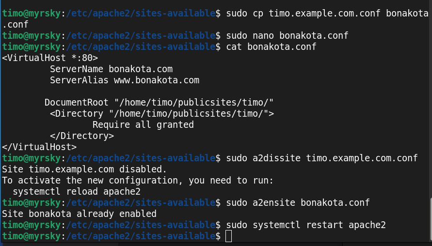  

Sivu alkoi heti näkymään netissä osoitteessa bonakota.com  

  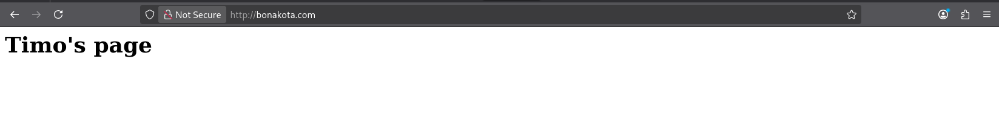  

Kokeilin myös kännykällä ja sivu näkyy siellä samalla tavalla. 
Lisäksi kokeilin www.bonakota.com ja se toimii myös.  

## b) Alidomain. Tee kaksi uutta alidomainia.  

Tein uuden alidomainin domain list:n kautta bonakota.com Namecheapin kautta. 
Tämä tehtävän mukaisesti A Record:a käyttäen.  Uuden alidomainin nimi on try.bonakota.com

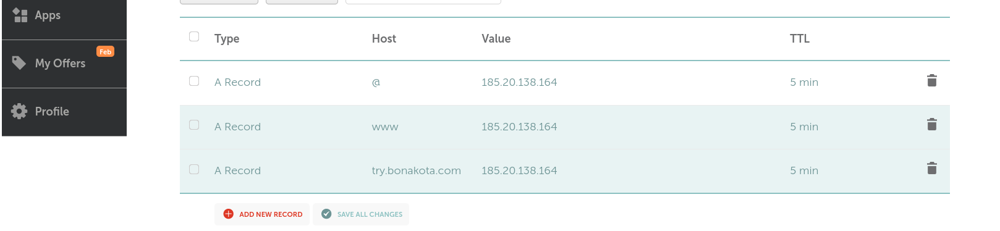 

Tämä ei varmaankaan vielä toimi näin, mutta testataan:  

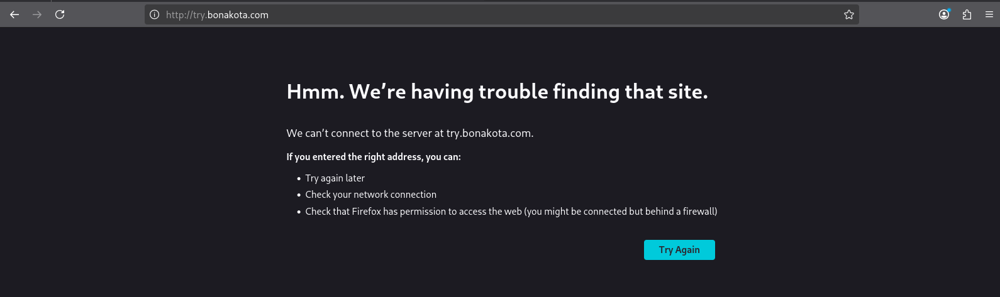 

Ei toiminut. Pitänee lisätä try.bonakota.com .conf tiedostoon.  

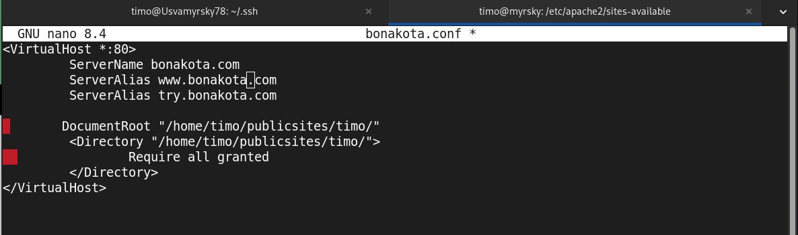 

Tämäkään ei auta ja virheilmoitus on sama kuin aiemmin.  
Ehkä kuitenkin on syytä etsiä jokin lähde, missä asia selitetään paremmin.  
Lähteeksi löytyi: https://www.eksis.one/artikkelit/apache2/apache2-ja-alidomain/

Sivujen erottamiseksi toisistaan, haluan tehdä sivulle oman index.html tiedoston.  
Tehdään ensin uusi hakemisto polkuun  
*/home/timo/publicsites/*  ja lisätään sinne *index.html*    

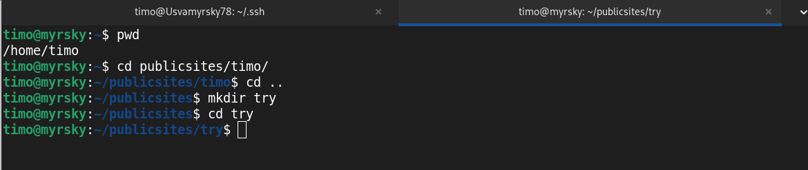 
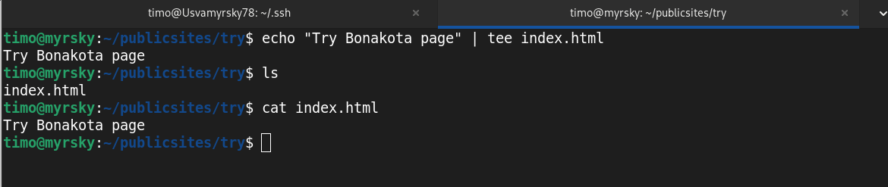 
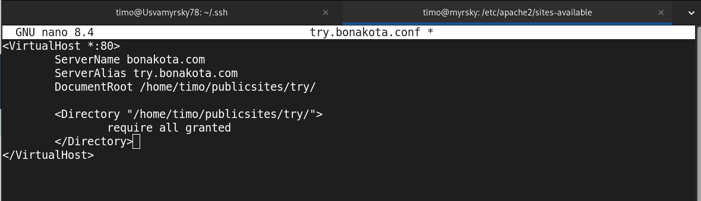 

En vieläkään saa sivua try.bonakota.com latautumaan. Selaimen konsolista ei myöskään ollut suuresti apua.  

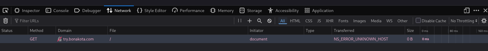 

Tutkin lisää ja tarkemmin lähdesivua.  
try.bonakota.com pitääkin määritellä ServerName, eikä alias. Se siis tarvitsee oman .conf tiedoston.  
Vaihtoehtoisesti sen voisi lisätä bonakota.conf tiedoston perään omana uutena VirtualHost:na, mutta  
oma try.bonakota.conf tiedosto mahdollistaa virtualhostien ensite ja dissite tekemisen erikeen. 

Käydään sen jälkeen luomassa uusi try.bonakota.conf tiedosto.  

 

Hemmetti - eihän tämä toimi vieläkään.  
Poistin try.bonakota.com tiedostosta serveraliaksen ja muokkasin *ServerName try.bonakota.com*  
Tämä alkoi toimimaan.  

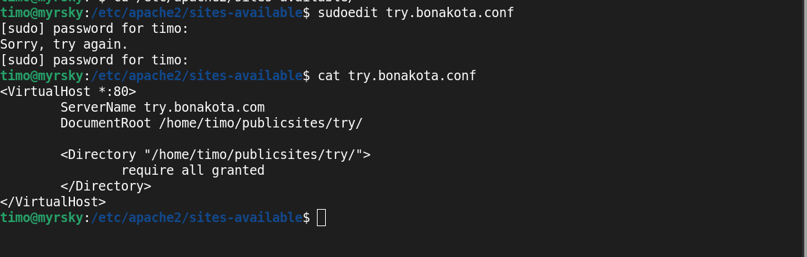 
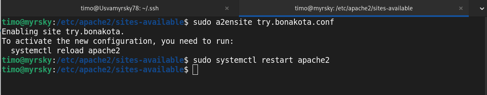 
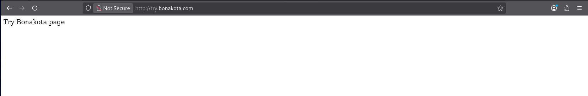 

Miksi näin? Tulin siihen tulokseen, että try.bonakota.com täytyy olla omana ServerName määritelty,  
koska se osoittaa omaan hakemistoon. Mikäli try.bonakota.com osoittaisi samaan hakemistoon kuin  
bonakota.com, silloin se voisi olla määritelty ServerAliaksena. Tämä käy järkeen, sillä ServerName ja
ServerAlias on osoitettava samaan polkuun.  
Päättelyn lisäksi on löysin saman tiedon myös Apachen dokumentaatiosta:  
https://httpd.apache.org/docs/current/vhosts/name-based.html?utm_source=chatgpt.com

Mielenkiinoinen yksityiskohta.  Apache lukee .conf tiedostot aakkosjärjestyksessä, joten jos aiemmin  
aakkosjärjestyksessä olevasta lokista löytyy etsintään kelpaava vastaus, se käytetään ja näytetään.  
Tämän vuoksi default loki on nimeltään 000-default.conf.  On siis tärkeää muistaa tämä jatkossa, jos  
VirtualHost:ja on käytössä enemmänkin.

CNAMEn lisääminen. 

CNAME eroaa A Recordista siten, että siinä DNS tunnusta käytetään aliaksena toisella domain nimelle.
Tämä eroaa A Recordista käytännössä niin, että samalla kun A Record laitetaan osoittamaan suoraan  
IP osoitteeseen (kuten 185.20.138.164), laitetaan CNAME osoittamaan domain nimeen (bonakota.com).  

CNAME suurin hyöty on yksinkertaistaa kokonaisuuden hallintaa 

Lähde: https://dnsmadeeasy.com/resources/cname-records-explained  

Lisäsin CNAME tiedon DNS tietoihin nimipalvelussa ja .conf tiedostoon.

KUVA-lisätty nimi palveluun namecheap cname
 

KUVA - bonakota.conf
 

Sivu ei kuitenkaan heti latautunut.  

KUVA - error 
 

Tämä oli outoa, koska ping ja curl sivusta toimivat.  

KUVA ping curl  
 

Toisella laitteella tämä kuitenkin toimi ja lopulta sivu latautui myös tässä koneella.  

KUVA - TOINEN LAITE
 

KUVA - support.bonakota.com
 

## Lähteet  

EksisONE 2012: https://www.eksis.one/artikkelit/apache2/apache2-ja-alidomain/  
Apache: https://httpd.apache.org/docs/current/vhosts/name-based.html?utm_source=chatgpt.com
