Kirjoittanut Timo Lampinen 2026  
Linux-palvelimet kurssi - ICI003AS2A-3016  
Tehtävä h6 sivulta: https://terokarvinen.com/linux-palvelimet/  

# Tehtava H6 Salataampa

## x) Lue ja tiivistä  

Let's Encrypt 2024: How it works (https://letsencrypt.org/how-it-works/)  
- ensimmäiset kaksi vaihetta tarkastetaan authoroitu client. Luotuja salausavainpareja käyttäen Let's Encrypt tarkastaa usealla haasteella, että domain on clientin hallussa
- toisessa vaiheessa tarkastetaan, voidaanko haasteet suorittaa useasta verkkonäkökulmasta
- Tämän jälkeen olla valmiita antamaan sertifikaatti. Client rakentaa pyynnön (CSR) Let's Encryptille myöntää sertifikaatti. Let's Encrypt tarkastaa, että CSR:ssä ja domainissa käytetään authorisoituja selausavaimia. Jos kaikki tsekkaa sertifikaatti myönnetään.
- Let's Encrypt jakaa tiedon sertifikaatista eteenpäin.
- Sertikaatin poistossa tarvaitaan salausavainpari ja Let's Encrypt vahvistaa, että pyyntö on authorisoitu.

The Apache Software Foundation 2025: Apache HTTP Server Version 2.4 [Official] Documentation: SSL/TLS Strong Encryption: How-To: (https://httpd.apache.org/docs/2.4/ssl/ssl_howto.html#configexample)  
-  

## a) Let's - asenna palvelimellesi ilmainen TLS-sertifikaatti Let's Encryptilta. Osoita, että se toimii.  

Kirjaudun ensin sisään palvelimelle  ja varmistetaan, että daemon apache2 on käynnissä  
*ssh timo@185.20.138.164*  
*sudo systemctl restart apache2*  

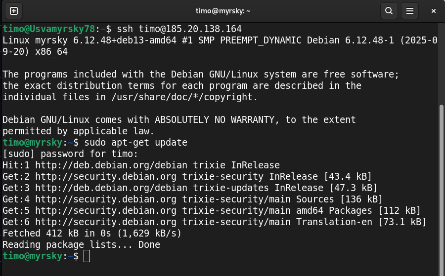  
  

Tarkastetaan web-sivun näkyvyys lataamalla bonakota.com.
Toimii tällä koneella, sekä toisella koneella. 

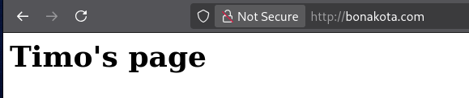  

Ensin update palvelimen ohjelmistolle  
*sudo apt-get update*  

Asennan palvelimelle certbot:n, python3-certbot, python3-certbot-apache
*sudo apt install certbot*  
*sudo apt install python3-certbot*  
*sudo apt install python3-certbot-apache*  

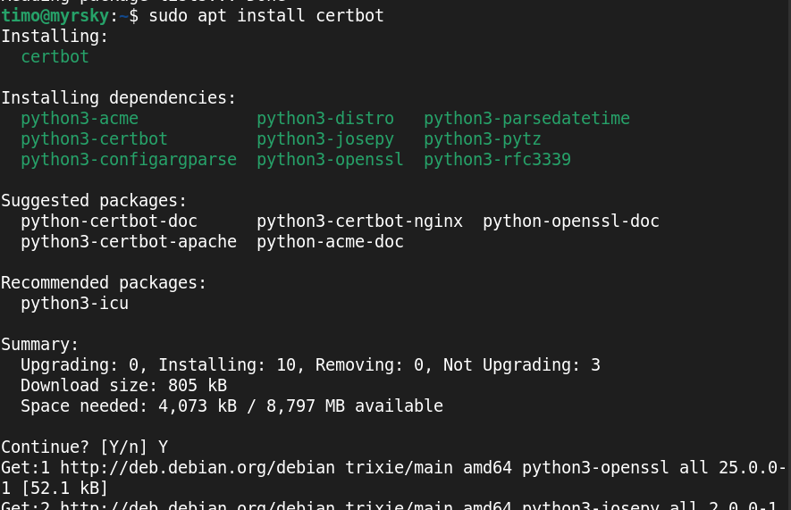  
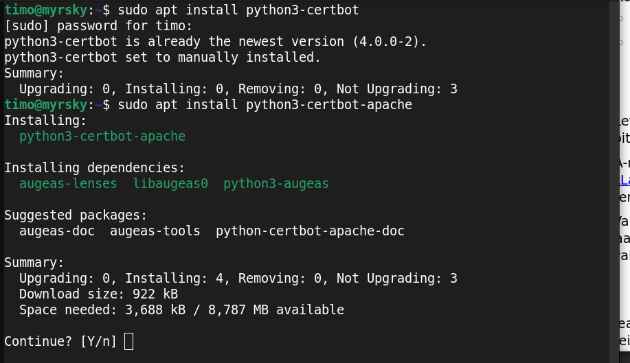  

Käynnistetään certbot ja asennetaan sertifikaatit kaikille sivustoille tämän alla  
*sudo certbot*  

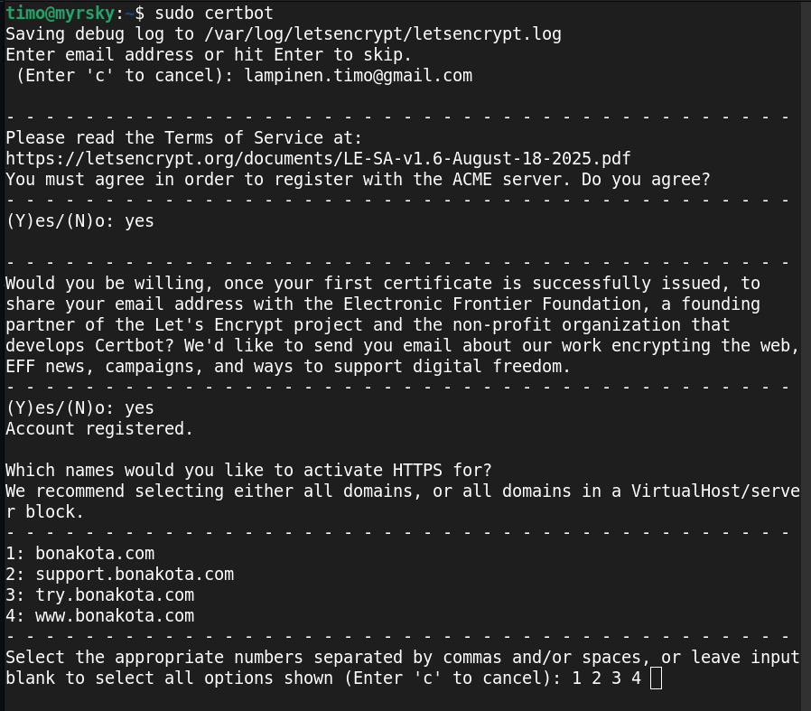  
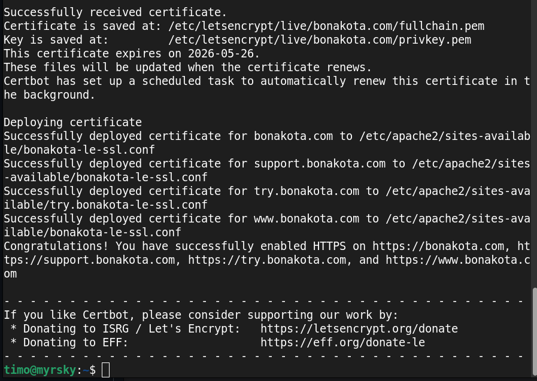  

Tarkastetaan mille porteille on reikä palomuurissa  
*sudo ufw status verbose*  

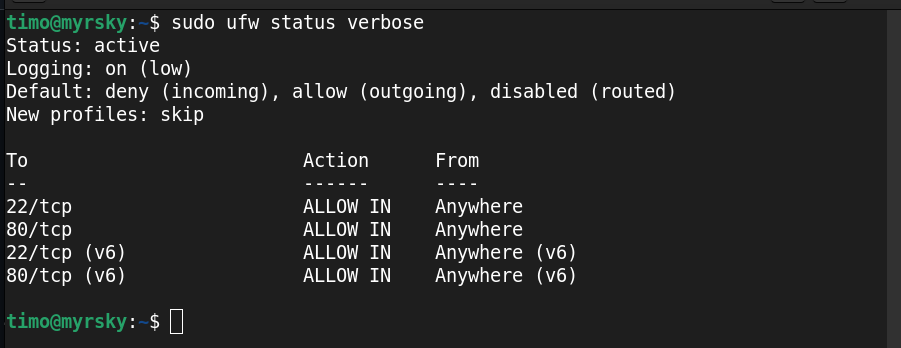  

Tehdään reikä palomuuriin https portille 443. Tarkastetaan reiät palomuurissa.  
*sudo ufw 443/tcp*  
*sudo ufw status verbose*  

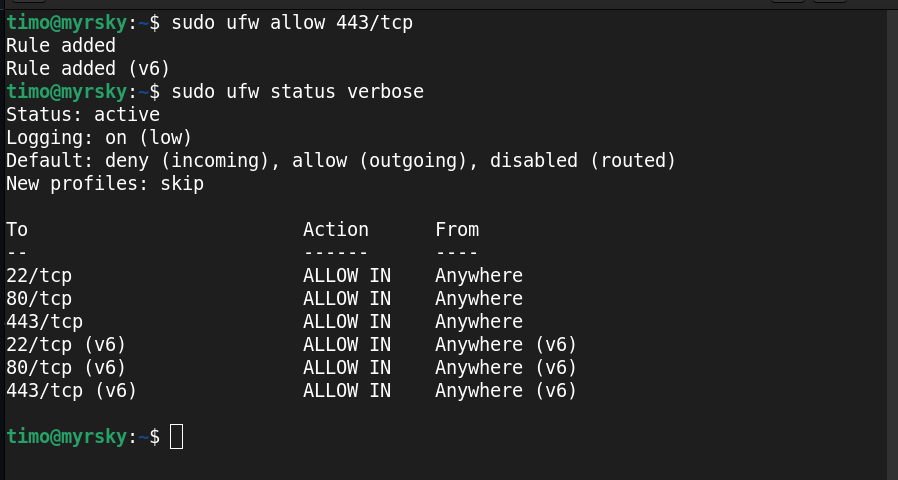  

Kokeillaan toimiiko bonakota.com https protokollalla sivulla https://bonakota.com  

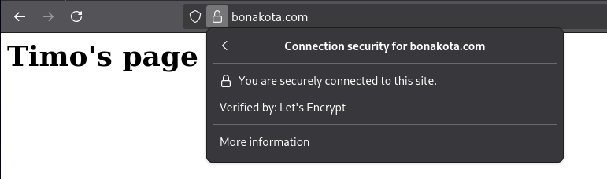  

Lukko osoittaa, että kyseessä on https protokolla, mutta avatessamme koko url:n todennamme https:n näkyvän myös kokonaan.  
Lukosta painaen näemme, etät kyseessä on Let's Encryptin sertifikaatti.

Testasin varmuuden vuoksi vielä toisella koneella ja puhelimella bonakota.com, www.bonakota.com, try.bonakota.com sekä support.bonakota.com kaikki toimivat.  

## b) A-rating. Testaa sivusi TLS laadunvarmistustyökalulla  

Testataan bonakota.com osoitteessa www.ssllabs.com  

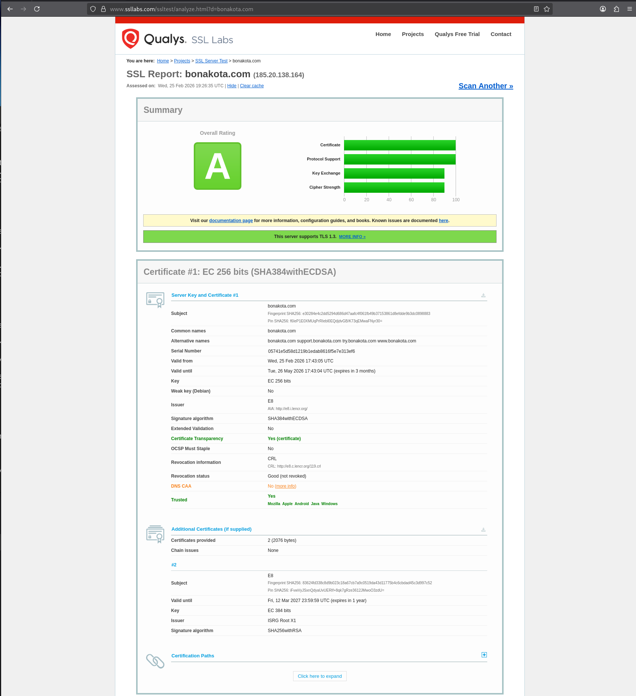  

Näyttää toimivan. Toki DNS CAA tuottaa vastauksen no. Katsoessa infoa selviää, ettei tämä ole vielä monellakaan nettisaitilla käytössä
Mukana on lisää sivuja, jotka kertovat lisää tietoa. Tässä pieni näyte:

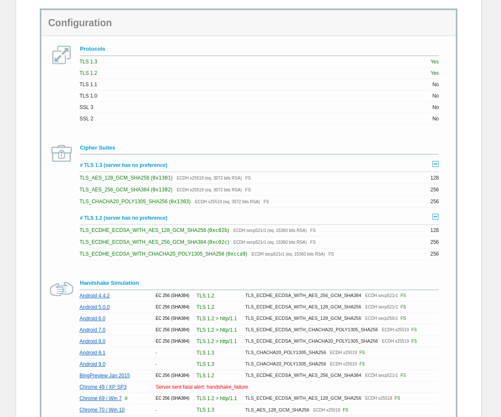  
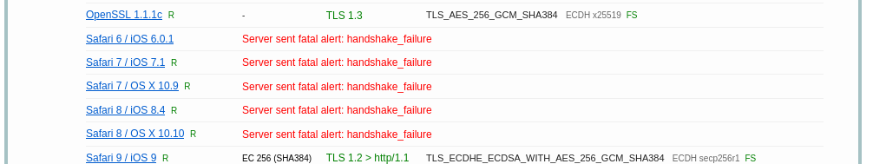  

Huomaamme että sivulla ovat voimassa protokollat TLS 1.2 ja TLS 1.3.   
On mielenkiintoista huomata myös, että monella handshake-simulaatio toimii, mutta Chrome 49 + window XP Service Pack 3 kokonaisuudessa ei toimi. Myös Safarin muutamat versiot vanhoilla iOS käyttöjärjestelmillä, eivät onnistu handshake testissä. 

Kokeilen lisätä DNS CAA palvelimen tietoja, saisiko sillä tuota muutettua, seuraavilla DNS palvelun asetuksilla.  

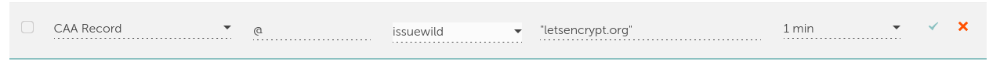  

Katsotaan mikä on tulos SLS Labs:n testissä

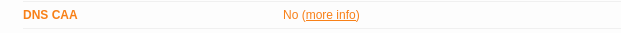  

Sls Labs antaa edelleen virheellisen tiedon. 
Kokeilen mitä dig antaa komennolla  
*dig CAA bonakota.com"  

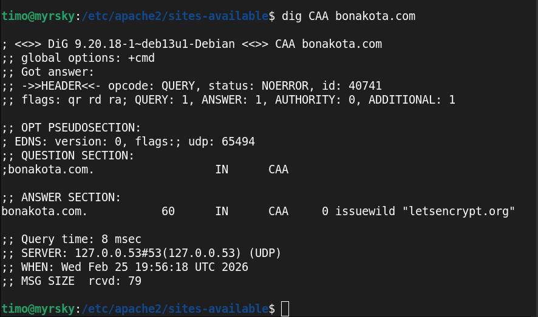  

Dig kertoo, että CAA on näkyvillä, mutta SLS Labs:n testi antaa silti no. Lopetan tältä päivältä.  

Seuraavan päivän SLS Labs ajo antaa DNS CAA ok tuloksen.  

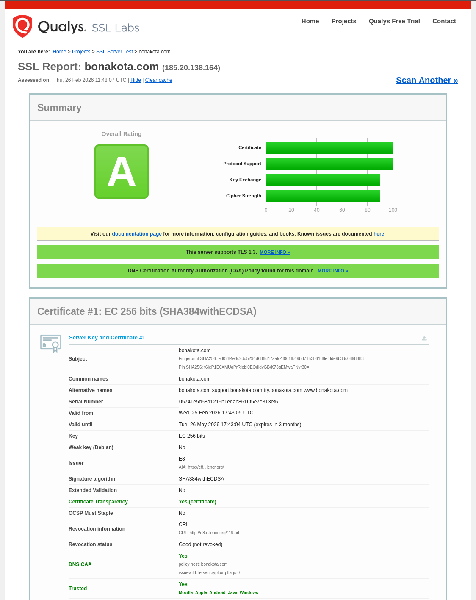  

On näköjään tärkeä huomata, että joskus tietojen päivittymienn voi kestää pitkään.  
Mietin myös, että olisi ollut hyödyllistä ajaa testi toisella koneella tai edes selaimella.  
Voisiko kyseessä olla välimuistissa olevat tiedot, vaikka teinkin latauksen aina painamalla Clear Cache nappia SLS Labsssa.  

## c)
