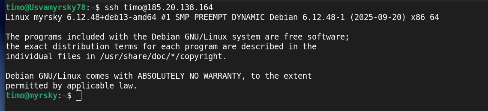
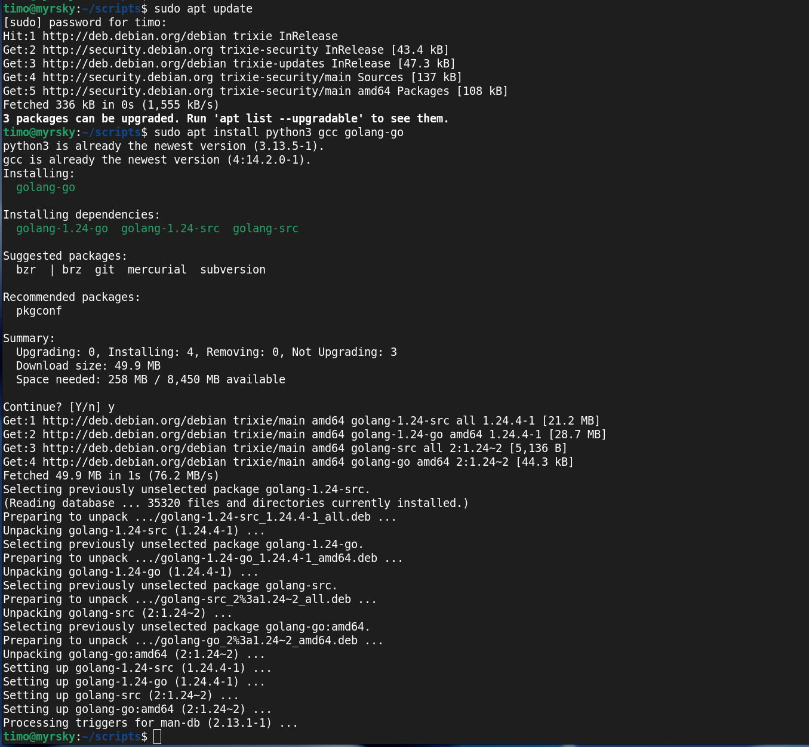
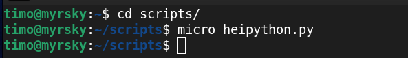
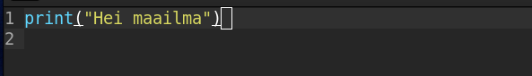
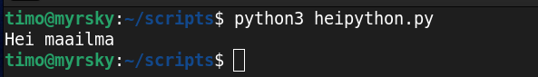

Kirjoittanut Timo Lampinen 2026  
Linux-palvelimet kurssi - ICI003AS2A-3016  
Tehtävä h7 sivulta: https://terokarvinen.com/linux-palvelimet/  

# Tehtava H7 Maalisuora

## a) Kirjoita Hei Maailma kolmella kielellä  

Kirjaudutaan omalle palvelimelle  
*ssh timo@185.20.138.164*  

  

Tehdään ohjelmat kolmelle eri kielellä: Python, C ja Go.   

Ensin päivitetään ja asennetaan ohjelmat Python, C ja Go käskyillå:
*sudo apt update*  
*sudo apt-get install python3 gcc golang-go*  

  

Siirrytään aiemmin tehtyyn scripts hakemistoon ja aletaan tekemään micro-ohjelmalla heipython.py tiedostoa  
*cd scripts*
*micro heipython.py*

  

Kirjoitetaan print komento python-kielellä 

  

Ajetaan heipython.py  
*python3 heipython.py*  

  

## Lähteet 

Karvinen:  https://terokarvinen.com/linux-palvelimet/  
