Kirjoittanut Timo Lampinen 2026  
Linux-palvelimet kurssi - ICI003AS2A-3016  
Tehtävä h7 sivulta: https://terokarvinen.com/linux-palvelimet/  

# Tehtävä H7 Maalisuora

## a) Kirjoita Hei Maailma kolmella kielellä  

Kirjaudutaan omalle palvelimelle  
*ssh timo@185.20.138.164*  

  

Tehdään ohjelmat kolmelle eri kielellä: Python, C ja Go.   

Ensin päivitetään ja asennetaan ohjelmat Python, C ja Go käskyillå:
*sudo apt update*  
*sudo apt-get install python3 gcc golang-go*  

  

Siirrytään aiemmin tehtyyn scripts-hakemistoon ja aletaan tekemään micro-editorilla heipython.py tiedostoa  
*cd scripts*
*micro heipython.py*

  

Kirjoitetaan print komento python-kielellä 

  

Ajetaan heipython.py  
*python3 heipython.py*  

  

Toimii!  
  
Aloitetaan kirjoittamaan ohjelmaa c-kielellä  
*micro heic'

  

Kirjoitetaan ohjelma.  
lähteenä:  https://www.geeksforgeeks.org/c/c-hello-world-program/  

  

C-ohjelmat pitää ensin kääntää ohjelmiksi. Kääntäminen tapahtuu komennolla: gcc heic.c -o heic  
Syntaksin selitys:   
- gcc on kääntäjä
- heic.c lähdekoodin tiedosto joka käännetään
- -o kertoo että seuraavaksi tulee käännetyn tiedoston nimi
- heic on käännetyn ohjelman nimi
  
Suoritetaan komento ja ajetaan ohjelma heic tässä kansiossa komennoilla:  
*gcc heic.c -o heic*  
*./heic*  

  

Huomaamme, että printf komentomme lopussa ei ole rivinvaihtoa, joten komentokehoite tulostuu heti kirjoituksen perään.  
Lisätään microlla rivinvaihto, joka toteutuu, kun laitetaan \n  printf komennon sisälle. 

  

Käännetään ohjelma ja ajetaan se:  
*gcc heic.c -o heic*  
*./heic*

  

Hienoa. Nyt ohjelma toimii kuten pitää.  

Tehdään Hei maailma ohjelma käyttäen Go-kieltä. Itselleni tämä kieli on täysin tuntematon, joten etsin sopivan lähteen.  
Lähde:   https://gobyexample.com/hello-world  
Aletaan kirjoittamaan koodia komennolla  
*micro hei-maailma.go*  

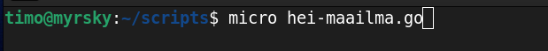 

Kirjoitetaan ohjelma microlla  

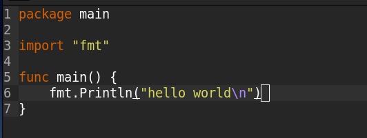 

Ajetaan ohjelma komennolla  
*go run hei-maailma.go*  

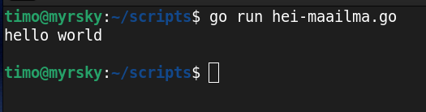 

Toimii. Käännetään seuraavaksi go ohjelmaksi ja ajetaan se  
*go build hei-maailma.go*  
*go build hei-maailma.go*  

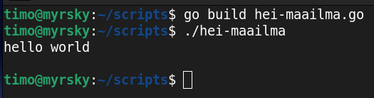 

Toimii. Hienoa.  

## b) Lähdeviitteet. Tarkista ja tarvittaessa lisää lähdeviitteet kaikkiin raportteihisi

Puutteet korjattu 

## c) Laita Linuxiin uusi, itse tekemäsi komento niin, että kaikki käyttäjät voivat ajaa sitä.  

Päätin tehdä scriptin, joka näyttää palvelimen tietoja yhdellä komennolla. Koska komentoa server ei ole, päätin tehdä sen sille nimelle  
*micro server* 

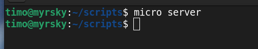

Alkuun asetetaan, millä komento ajetaan eli bash. Sen jälkeen muut kommennot:  
*#!/bin/bash* määrittää millä komennolla script suoritetaan. Scripteissä se on bash    
*echo "Server: $(hostname)* tulostaa Server: ja hostname. Lähde: https://linuxize.com/post/echo-command-in-linux-with-examples/    
"echo "User: $(whoami)* tulostaa User: ja käyttänimen  
*echo "Uptime:"* tulostaa Uptime:  
*uptime* tulostaa kuinka kauan palvelin on pyörinyt. Lähde: https://www.site24x7.com/learn/linux/uptime.html   
*echo "Disk usage:"*  tulostaa Disk usage:  
*df -h /* tulostaa järjestelmän levytilan käytön tietoja. -h näyttää koko tiedot luettavassa muodossa (KB, MB, GB). / viittaa juurihakemistoon (root directory). df -h / näyttää sen tiedostojärjestelmän levytilan, jossa juurihakemisto sijaitsee. Lähde: https://linuxize.com/post/how-to-check-disk-space-in-linux-using-the-df-command/  

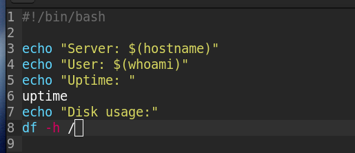

Script täytyy muuttaa ensin ajettavaan muotoon oikeuksia muokkaamalla ja sen jälkeen se voidaan ajaa.  
*chmod ugo+x server*  
*./server*  

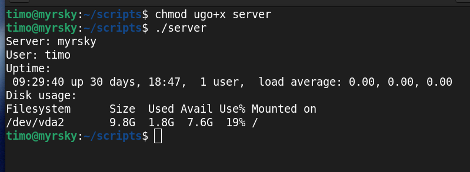

Siirretään script /usr/local/bin kansioon ja ajetaan se käskyillä  
*sudo cp server /usr/local/bin*  
*server*  

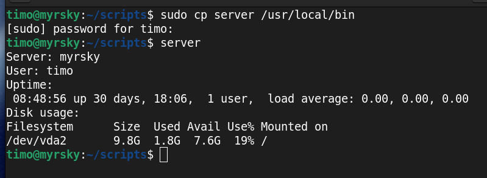

Toimii. 

## d) Ratkaise vanha arvioitava laboratorioharjoitus soveltuvin osin.  

Valitsin tehtäväksi DJ Hatut tehtävän 2024 syksyn kurssilta (https://terokarvinen.com/2024/arvioitava-laboratorioharjoitus-2024-syksy-linux-palvelimet/  kohta g). 

Tehtävänanto on:  

Prosessinhallintaa ja lokeja.  
a) Kuormitusta yli ajan. Tietysti palvelin hidastelee juuri silloin, kun olet nukkumassa. Seuraisipa joku kuormitusta tuolloin.   Asenna heti aluksi jokin ohjelma seuraamaan kuormitusta, jotta voit tarkastella sitä koko tehtävän ajalta. Sopivia ohjelmia ovat esimerkiksi 'munin' ja sysstat ('sar').  
b) Kuormita järjestelmän eri osa-alueita. Esim. 'stress'. Etsi prosessi toisesta ikkunasta 'top' tai 'htop', järjestystä voi vaihtaa "P" ja "M".  
Kokeile käytännössä, selitä ja analysoi. Muista selittää, mitä komennolla halutaan selvittää ja tulkitse kokeilusi tulokset. Aiheuta tarvittaessa kuormaa tai muuta työkalulla näkyvää tulkittavaa.  
c) iotop; iotop -oa  
d) dstat  
e) ss --listening --tcp --numeric; ss --listening --tcp; ss --tcp; ss --listening --udp; ss --listening --udp;  
f) grep -i error /var/log/syslog; grep -ir error /var/log/  
g) Load average näkyy esim 'uptime', 'top', 'htop'. Prosessoriydinten määrä näkyy 'nproc'. Miten load average tulkitaan? Miksi prosessoriydinten määrä on tässä kiinnostava? Vapaaehtoisena bonuksena voit miettiä, mitä hyötyä on kuormituslukemasta, joka voi mennä yli yhden eli yli 100%.  
h) Analysoi lopuksi koko ajalta keräämäsi kuormitustiedot. Löydätkö esimerkiksi aiheuttamasi kuormituspiikin?  

### a) asennetaan ohjelma 

asennetaan sysstat. Lähde: https://www.geeksforgeeks.org/linux-unix/sar-command-linux-monitor-system-performance/    
*sudo apt install sysstat*  

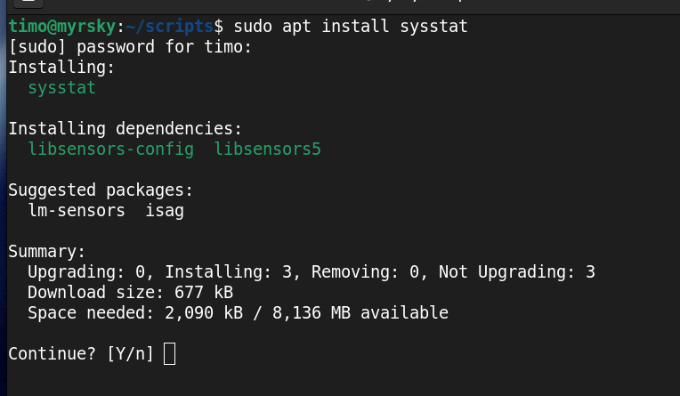

### b) kuormitaa järjestelmää  

asennetaan stress  
*sudo apt install stress*  

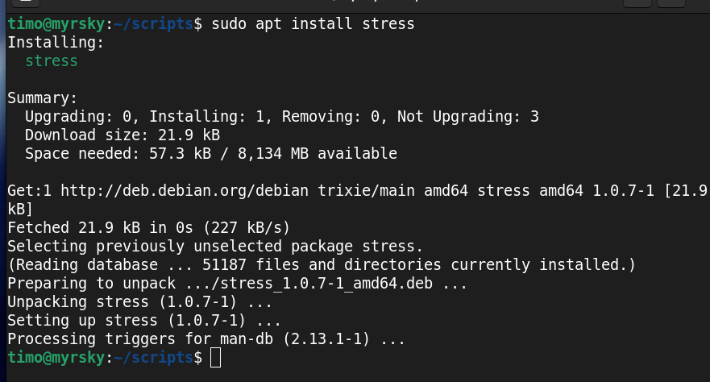

käynnistetään monitorointi toisessa terminaalissa komennolla   
*sar -u 1*  

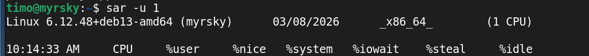

stress ohjeita https://www.geeksforgeeks.org/linux-unix/linux-stress-command-with-examples/  
Käynnistetään kuormitus 10 sekunniksi komennolla  
*stress -c 8 --timeout 10*  
c tarkoittaa 8 cpu:ta ja timeoutilla määritellään kesto

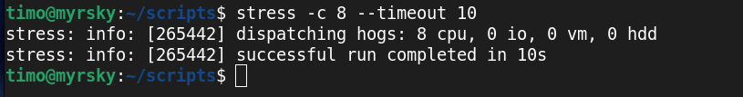

Katsotaan mitä *sar -u 1* komento näyttää tuolta ajalta  

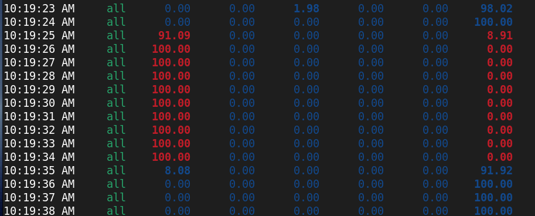

Näemme selkeästi, että cpu kuormittuu täysille tuoksi ajaksi, eikä järjestelmä ole idle hetkeäkään

Katsotaan mitä muistin käyttöa voidaan testata.  
Laitetaan muistin monitorointi päälle komennolla  
*sar -r 1 25*  

testataan muistia komennolla  
*stress --vm 10 --vm-bytes 256*   

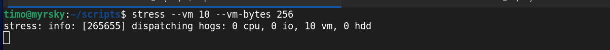

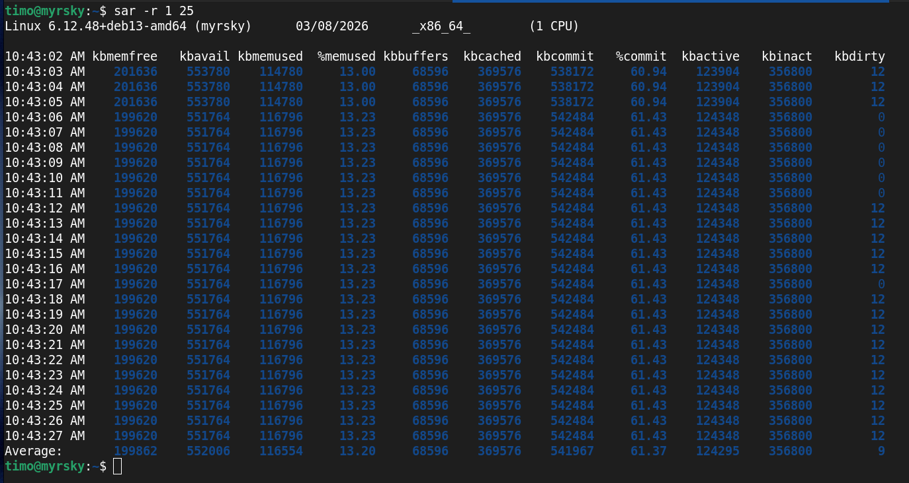

Tulosteesta ei voi päätellä okein mitään. Ainoa arvo mikä muuttuu on kbdirty, mutta arvo on koko ajan niin pieni, ettei siitä oikein voi päätellä mitään - paitsi, että kun se on 0, ei ole yhtään dataa odottamassa kirjoittamista levylle.  iot

### c) iotop

iotop tarkastelee järjestelmän levylle kirjoittamista ja lukemista. Lähde: https://www.geeksforgeeks.org/linux-unix/iotop-command-in-linux-with-examples/

asennetaan iotop komennolla  
*sudo apt install iotop*  

käynnistin ohjelman annetulla komennolla  
*sudo iotop -oa*  
- o parametri näyttää prosessit, jotka oikeasti suorittavat I/O toimintoja  
- a parametri näyttää kertyneen IO-käytön ajan kuluessa  

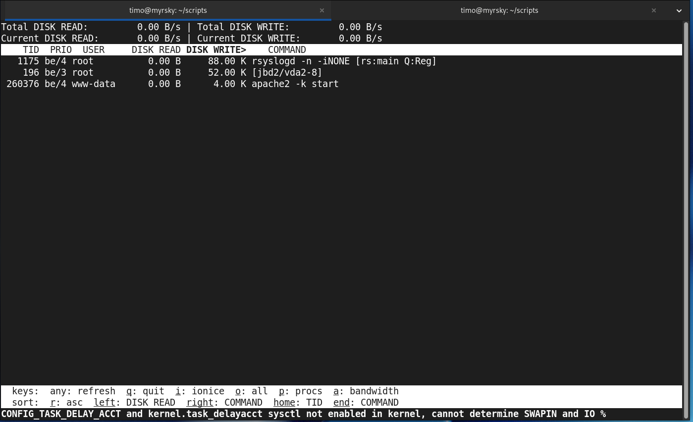  

Näemme päivittyvät. Koska loki näytti tyhjältä, latasin sivuni bonakota.com, jolloin viimeinen rivi, missä apache2 on mainittu tuli näkyviin.  Tarkastellaan rivin tietoja:  
260368 be/4 www-data 0.00 B 4.00 K apache2 -k start  
- 260368 on prosessin id
- be/4 on I/O-prioriteetti (best effort, taso 4)
- www-data on käyttäjä, jonka oikeuksilla prosessi toimii
- 0.00 B kertoo paljonko lukee levyltä nyt  
- 4.00 K kertoo paljonko kirjoittaa levylle nyt  
- apache2 -k start on käynnistetty ohjelma parametreineen

Huomasin myös, että ladattaessa sivu Total DISK WRITE ja Current DISK WRITE antavat pieniä lukuja.  

Epäilen, että nämä ovat lokitiedostoja, mitä kirjoitetaan apachen lokeihin. Testaan näin:   
*cd /var/log/apache3/*  
*tail other_vhosts_access.log*  
Lataan tässä välissä selaimessa bonakota.com sivun (joka on tällä palvelimella).  
Samaan aikaan iotop näkymässä on muutosta disk write. 
*tail other_vhosts_access.log*  

Iotop -oa näkymän muutos:  
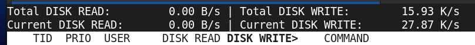  

molemmat lokit, joista jälkimmäiseen on tullut lisäys:  
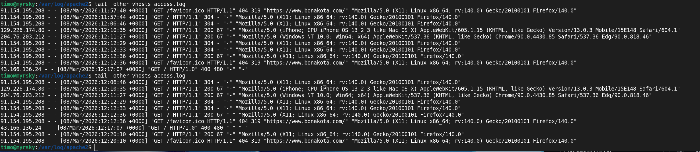  

Tämä ei aukottomasti todista, että kyse on juuri tuosta tapahtuamasta, koska kirjoitustapahtumia voi myös olla muita. Todennäköisesti tämä on yksi kyseisistä tapahtumista. Tämä on omaa päättelyäni ja todistaakseni tämän aukottomasti pitäisi sama tapahtuma toistaa useita kertoja, että tultaisiin varmemmin siihen tulokseen, että tämä on yksi suoritettuista kirjoitusprosesseista. 

### d) dstat  

dstat on työkalu, jolla näemme Linuxin järjestelmän resurssienkäyttöä reaaliajassa.
Lähde https://www.geeksforgeeks.org/linux-unix/dstat-command-in-linux-with-examples/  

asennus  
*sudo apt install dstat*  

katsotaan mitkä ohjelmat käyttävät eniten prosessoria kommennolla  
*dstat -c --top-cpu*  

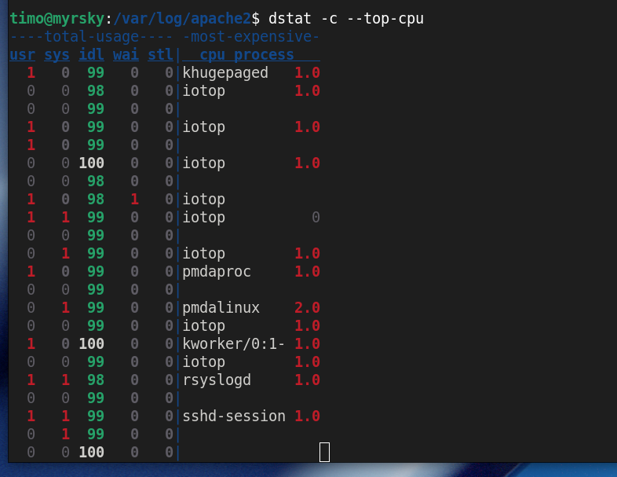  

ensimmäiset viisi kertovat montako prosenttia prosessorin käytöstä on milläkin.
esim: katsotaan alhaalla olevaa riviä, jossa mainitaan sshd-session käytössä olevanap prosessina 
- usr 1, CPU:sta 1% käyttäjän käytössä
- sys 1, CPU:sta 1% järjestelmän käytössä
- idl 99, 99% ajasta CPU odottaa kuormaa
- wai 0, 0% ajasta CPU odottaa I/O:ta
- stl 0, 0% ajasta on käytössä virtuaalikoneissa (steal)
- cpu process sshd-session 1.0 näyttää CPU prosessin nimen ja 1.0 on prosessin ID

Prosessorilla voi olla käytössä vain 100%. Nyt yhteenlaskettu kuorma on 101%. Miten tämä on mahdollista?  
Kyseessä on varmasti hyvin harvinainen pyöristysvirhe, jossa esimerkiksi sys arvo on oikesti 0,5% ja usr arvo on 98,5%.  
Molemmat näytetää kuitenkin ilman desimaaleja ja tässä tapauksessa molemmat pyöristetään ylöspäin.  
Tätä tukevat myös huomiot, että jossain kohti yhteenlaskettu summa on alle 100%, kuten 99 tai 98 prosenttia. Tämä on täysin mahdollista kun otetaan huomioon pyöristykseen liittyvät säännöt.  
  
ajetaan samalla 
*stress -c 8 --timeout 10*  

tulokset dstat  

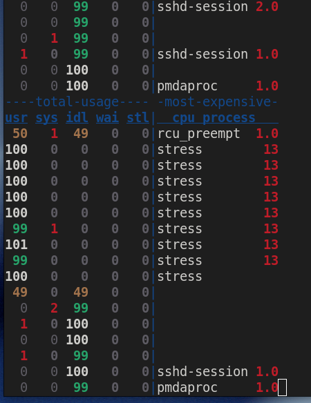  

huomaamme stress prosessin aiheuttavan kuorman ja vievän kaiken prosessoritehon.

### e)  ss --listening --tcp --numeric; ss --listening --tcp; ss --tcp; ss --listening --udp; ss --listening --udp;

ss (Socket Statistics) komennolla voidaan tarkastella network socket tilaa Linux järjestelmässä.

Tutustuin ss komentoon seuraavassa lähteessä.
Lähde: https://www.geeksforgeeks.org/linux-unix/ss-command-in-linux/

SS komento toimi heti, joten sen asennusta en alkanut selvittämään.  

*ss --listening --tcp --numeric; ss --listening --tcp; ss --tcp; ss --listening --udp; ss --listening --u*

  

selvitellään eroja.. 
ss --listening --tcp --numeric; ja  ss --listening --tcp; erot:

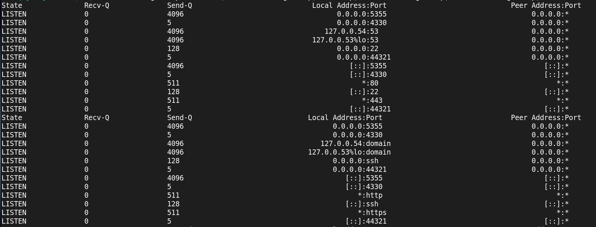  

Erona on Local Adddress:Port kohdan Port arvot.  
ss --listening --tcp --numeric; <- Port arvot ovat numeraalisia, kuten *:433  
ss --listening --tcp; <- Port arvot ovat kirjoitettu, kun sellaiset arvot löytyvät, eli *:433 on muodossa *:https  
Yhteistä on se, että tässä State on LISTEN, joka kertoo, että palvelu odottaa yhteyttä ja portissa 443 odotellaan https yhteyttä.  Peer Adress on tyhjä tai 0.0.0.0, koska mistään ei olla yhteydessä.

*ss --tcp*  

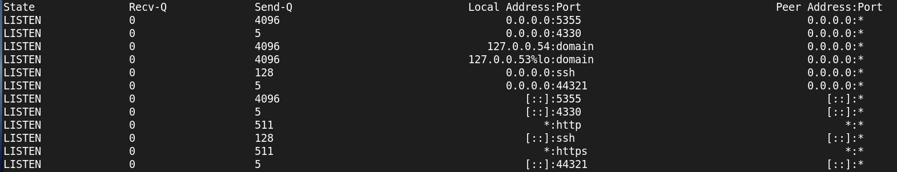   

Nyt emme vain kuuntele

State on nyt ESTAB, joka kertoo, että yhteys on luotu.  
Local Address:Port 185.20.138.164:ssh, kertoo että IP-osoitteeseen 185:20.138.164 on luotu ssh yhteys  
Peer Address:Port 91.154.195.208:45160, kertoo mistä kohteesta ollaan yhteydessä ja mihin porttiin. Tuossa tosiaan näkyy minun kotini ip-osoite, mistä ssh yhteys on tehty. Tuossa on varmasti kaksi porttia sen vuoksi, että minulla on kaksi ssh-yhteyttä auki. 
State SYN-RECV tarkoittaa, että yhteyden muodostus on kesken.  

*ss --listening --udp*  

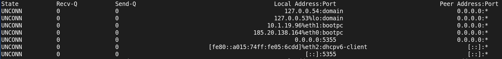 

näyttää kuuntelevat upd socketit. State on UNCONN, koska upd ei muodosta pysyviä yhteyksiä. 
Komento voidaan antaa myös muodossa: *ss -ul*  

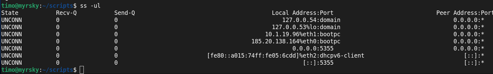 

*ss --listening --udp*  

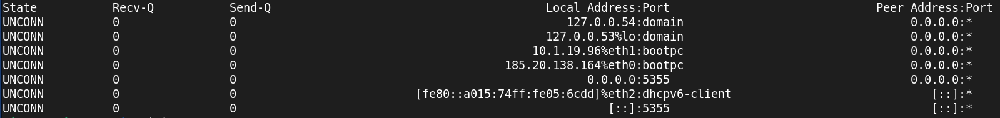  

Vastaus on sama kuin ylemmässä, koska komento on myöskin sama.  

### f) grep -i error /var/log/syslog; grep -ir error /var/log/  

Katsotaan ensin grep komennon käyttö näissä esimerkeissä. Lähde: https://www.hostinger.com/tutorials/grep-command-in-linux  

Grep syntaksi on:  
*grep [options] pattern [FILE]* 

-i määrittelee, että etsittävässä sanassa ei huomioida isoja tai pieniä kirjaimia
-r määrittelee, että etsitään rekursiivisesti myös alihakemistoista  
-ir peräkkäin, sisältää molemmat optiot i ja r
- error on pattern, eli etsitään sanaa error
- /var/log/ on polku, jonka alla olevista tiedostoita etsitään näitä tietoja 

*grep -i error /var/log/syslog*  

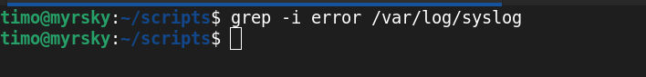  

Tyhjä. Missään tiedostossa ei ole error tekstiä.  
  
*grep -ir error /var/log/* 

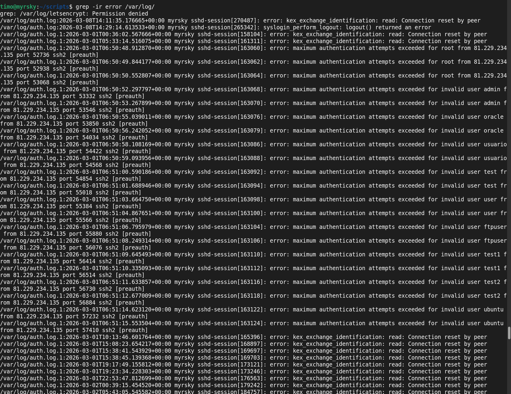  

Tässä näemme vain alun ja huomio kiinnittyy epäonnistuneisiin yrityksiin päästä sisälle.   
Siellä on selkeästi yritetty päästä sisälle nimillä admin, orackle, usuaric, test, uesr, ftpuser, test1, test2 ja ubuntu.  
Todennköisesti näillä on kokeiltu jotain tyypillistä salasanayhdistelmiä, kunnes palvelin ei enää hyväksy uusia yrityksiä.  
Kyse on siis automatisoidusta hyökkäyksestä.  
Tämän vuoksi varmasti salasanojen tärkeyttä on myös korostettu niin paljon.  

### g) Load average näkyy esim 'uptime', 'top', 'htop'. Prosessoriydinten määrä näkyy 'nproc'. Miten load average tulkitaan? Miksi prosessoriydinten määrä on tässä kiinnostava? Vapaaehtoisena bonuksena voit miettiä, mitä hyötyä on kuormituslukemasta, joka voi mennä yli yhden eli yli 100%.  

Testataan uptime-komennolla. 
*uptime* 

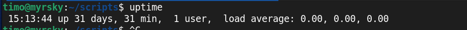  

Tiedot ovat aika tylsiä, sillä vaikka näemme kauanko palvelin on ollut pystyssä ja aktiivisiä käyttäjiä on vain yksi.  
load average kertoo vain ettei kuormaa ole ollut. 
Lukuja on 3, koska ne kertovat keskimääräisen kuorman 1 minuutin ajalla, 5 minuutin ajalla ja 15 minuutin ajalla.  
Tilanne jossa  yksi prosessoriydin  
- 0 ei toimintaa
- 1 yksi prosessi käyttää CPU:ta 
- 2 yksi prosessi käyttää CPU:ta ja toinen odottaa vuoroaan
- 4 yksi prosessi käyttää CPU:ta ja kolme odottaa vuoroaan

Tilanne jossa neljä prosessoriydintä  
- 0 ei toimintaa
- 1 yksi prosessi käyttää CPU:ta 
- 2 kaksi prosessia käyttää CPU:ta 
- 4 kaikki CPU:t käytössä 
- 7 neljä prosessia käyttää CPU:ta ja kolme odottaa vuoroaan

Luvut voivat olla myös desimaalilukuja.

Tehdään pieni testi ja stress ja katsotaan miten kone reagoi.  

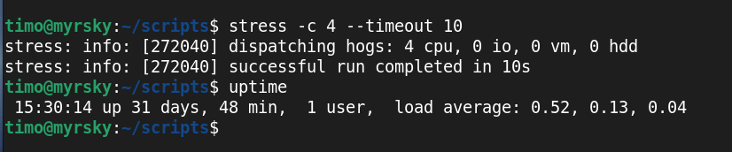  

Prosessien keskimääräinen kuorma jää siis viimeisen minuutin aikana 0.52 ja 5 minuurin aikana 0.13 ja 15 minuutin aikana 0.04.  

Palvelimella on vain yksi prosessoriydin, mutta en silti onnistunut saamaan täyttä kuormaa load averageen.  

### h) Analysoi lopuksi koko ajalta keräämäsi kuormitustiedot. Löydätkö esimerkiksi aiheuttamasi kuormituspiikin?

## Lähteet 

Karvinen 2026:  https://terokarvinen.com/linux-palvelimet/  
GeegsForGeegs.org - C-ohjelman lähde:  https://www.geeksforgeeks.org/c/c-hello-world-program/  
Go-ohjelman lähde: https://gobyexample.com/hello-world  
echo komennon lähde: https://linuxize.com/post/echo-command-in-linux-with-examples/  
uptime komennon käyttö lähde: https://www.site24x7.com/learn/linux/uptime.html  
df komennon käyttö lähde: https://linuxize.com/post/how-to-check-disk-space-in-linux-using-the-df-command/  
Vanha laboratirioharjoitus. Kohta g: https://terokarvinen.com/2024/arvioitava-laboratorioharjoitus-2024-syksy-linux-palvelimet/ 
GeegsForGeegs.org - Sar command to monitor system performance: https://www.geeksforgeeks.org/linux-unix/sar-command-linux-monitor-system-performance/  
GeegsForGeegs.org - Stress käytön esimerkkeja: https://www.geeksforgeeks.org/linux-unix/linux-stress-command-with-examples/   
GeegsForGeegs.org - iotop käyttö ja esimerkkejä: https://www.geeksforgeeks.org/linux-unix/iotop-command-in-linux-with-examples/  
GeegsForGeegs.org - dstat käyttö ja esimerkkejä: https://www.geeksforgeeks.org/linux-unix/dstat-command-in-linux-with-examples/  
GeegsForGeegs.org - ss käyttö ja esimerkkejä: https://www.geeksforgeeks.org/linux-unix/ss-command-in-linux/  
Hostinger - grep käyttö ja esimerkkejä: https://www.hostinger.com/tutorials/grep-command-in-linux  

