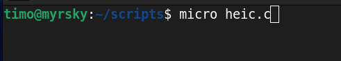
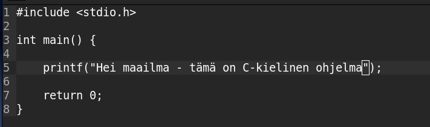
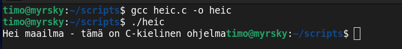
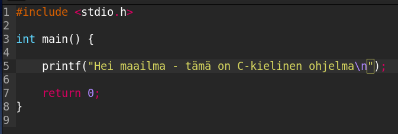
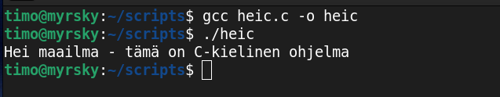

Kirjoittanut Timo Lampinen 2026  
Linux-palvelimet kurssi - ICI003AS2A-3016  
Tehtävä h7 sivulta: https://terokarvinen.com/linux-palvelimet/  

# Tehtava H7 Maalisuora

## a) Kirjoita Hei Maailma kolmella kielellä  

Kirjaudutaan omalle palvelimelle  
*ssh timo@185.20.138.164*  

  

Tehdään ohjelmat kolmelle eri kielellä: Python, C ja Go.   

Ensin päivitetään ja asennetaan ohjelmat Python, C ja Go käskyillå:
*sudo apt update*  
*sudo apt-get install python3 gcc golang-go*  

  

Siirrytään aiemmin tehtyyn scripts hakemistoon ja aletaan tekemään micro-ohjelmalla heipython.py tiedostoa  
*cd scripts*
*micro heipython.py*

  

Kirjoitetaan print komento python-kielellä 

  

Ajetaan heipython.py  
*python3 heipython.py*  

  

Toimii!  
  
Aloitetaan kirjoittamaan ohjelmaa c-kielellä  
*micro heic'

  

Kirjoitetaan ohjelma.  
lähteenä:  https://www.geeksforgeeks.org/c/c-hello-world-program/  

  

C-ohjelmat pitää ensin kääntää ohjelmiksi. Kääntäminen tapahtuu komennolla: gcc heic.c -o heic  
Syntaksin selitys:   
- gcc on kääntäjä
- heic.c lähdekoodin tiedosto joka käännetään
- -o kertoo että seuraavaksi tulee käännetyn tiedoston nimi
- heic on käännetyn ohjelman nimi
  
Suoritetaan komento ja ajetaan ohjelma heic tässä kansiossa komennoilla:  
*gcc heic.c -o heic*  
*./heic*  

  

Huomaamme, että print komentomme lopussa ei ole rivinvaihtoa, joten komentokehoite tullee kirjoituksen perään.  
Lisätään microlla rivinvaihto, joka toteutuu, kun laitetaan \n  printf komennon sisälle. 

  

Käännetään ohjelma ja ajetaan se:  
*gcc heic-c -o heic*  
*./heic*

  

## Lähteet 

Karvinen:  https://terokarvinen.com/linux-palvelimet/  
https://www.geeksforgeeks.org/c/c-hello-world-program/
